# CST8504 05 ROS2

*从PDF文档转换生成*

---

## 目录

- ROS2 Introduction Hybrid 4 + Lab4
- • Hybrid ROS2 introduction: ROS2 introductory tutorials.
- Detects 21 key landmarks (fingertips, joints, wrist) for each hand in real time.
- - Note that you need rclpy to be able to write pyhton codes.
- - Note that you need rclpy to be able to write pyhton codes.

---

*注: 共提取了 17 张图片*

## 第 1 页

Week 9: ROS2

---

## 第 2 页

ROS2 Introduction Hybrid 4 + Lab4

- Hybrid ROS2 introduction: ROS2 introductory tutorials.
- Lab – 4 ROS2 installation
- [https://docs.ros.org/en/humble/Tutorials/Beginner-CLI-Tools.html](https://docs.ros.org/en/humble/Tutorials/Beginner-CLI-Tools.html)

Nodes

Topics

Services

Actions

---

## 第 3 页

The big Picture

- Create Python packages aisd_vision and aisd_motion, use

MediaPipe Hands + OpenCV to detect hand positions and command motion.

- Create aisd_hearing packages using Whisper (STT) and

gTTS (TTS); record audio, transcribe speech.

- Deploy these packages in real application (Create3 robot)

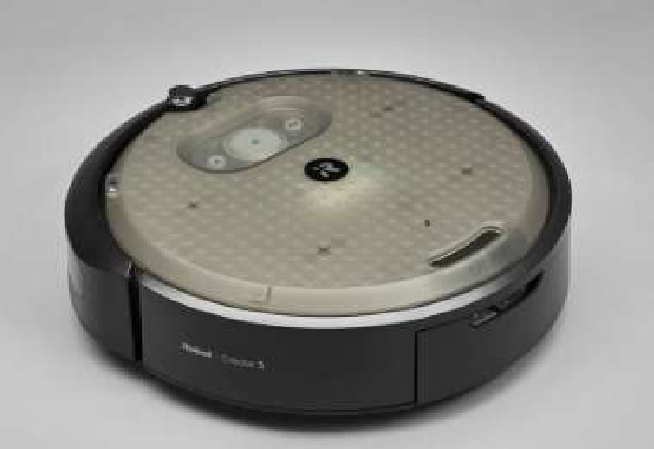

---

## 第 4 页

The big Picture OpenCV (Open-Source Computer Vision Library)
A powerful Python/C++ library for working with images and videos.
Handles low-level tasks like capturing frames from a webcam, resizing, color conversion, drawing, etc.
OpenCV reads the camera stream and provides each frame to the next stage (MediaPipe).
MediaPipe Hands A pre-trained hand-tracking model developed by Google.
Detects 21 key landmarks (fingertips, joints, wrist) for each hand in real time.
Returns normalized (x, y, z) positions of each point in the image.

---

## 第 5 页

The big Picture Whisper (Speech-to-Text, STT) An AI speech-recognition model by OpenAI.
Converts spoken audio (from a microphone or WAV file) into written text.
Handles many languages and accents, robust to noise.
In your aisd_hearing package, it turns your voice into text strings.

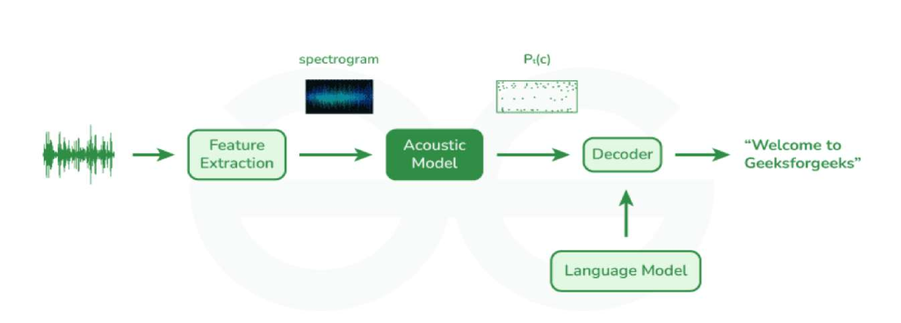

---

## 第 6 页

The big Picture

- Train Physical Reinforcement learning agents (Next semester )

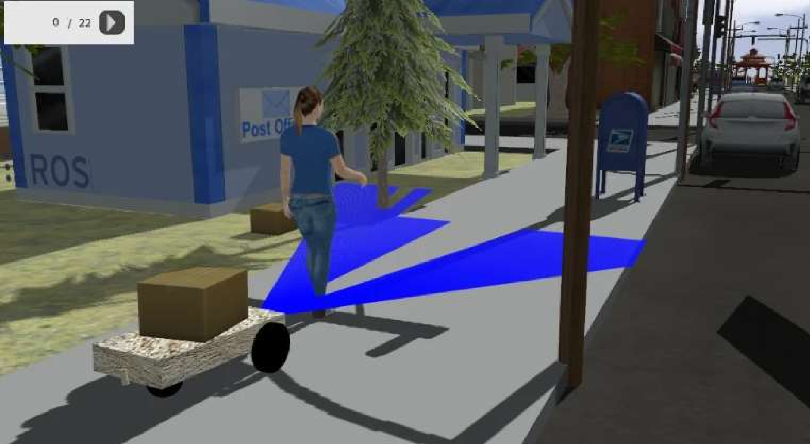

---

## 第 7 页

ROS2 Ecosystem

- ROS2 distributions (version):

[https://docs.ros.org/en/rolling/Releases.html](https://docs.ros.org/en/rolling/Releases.html)

- We will use Humble

---

## 第 8 页

ROS2 Ecosystem Installations

- [https://docs.ros.org/en/humble/Installation/Ubuntu-Install-Debs.html](https://docs.ros.org/en/humble/Installation/Ubuntu-Install-Debs.html)
- If you never worked in Ubuntu, take a look at the Linux revision

posted in Brightspace. You need to know basic commands like these

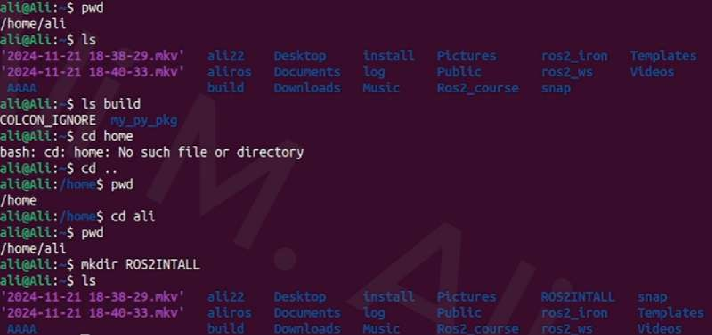

---

## 第 9 页

ROS2 Ecosystem

- After you install ROS2 humble distribution, check if it working or not. If you

type ROS2 and then double tab you will see a list commands can be used.

- Try ros2 run demo_nodes_cpp talker ,,,This will run a C++ node called

Talker inside a C++ Package called demo_nodes_cpp. The node will publish Hello World every second.

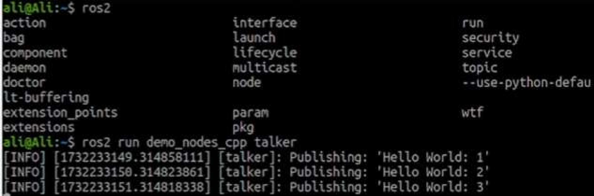

---

## 第 10 页

ROS2 Ecosystem

- Now in anther terminal you can type ros2 run demo_nodes_cpp listener.

This will run a C++ node that will listen to the published message and Type “I heard:….”

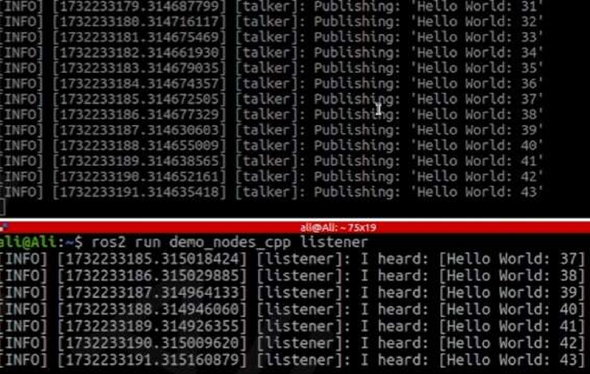

---

## 第 11 页

Building Packages in ROS2

- We will use a Library called Colcon.
- [https://docs.ros.org/en/humble/Tutorials/Beginner-Client-](https://docs.ros.org/en/humble/Tutorials/Beginner-Client-)

Libraries/Colcon-Tutorial.html

- Install Colcon as follows

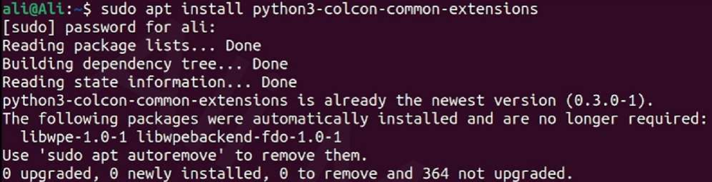

---

## 第 12 页

Building Workspace in ROS2

- Build now you first Workspace: using colcon build

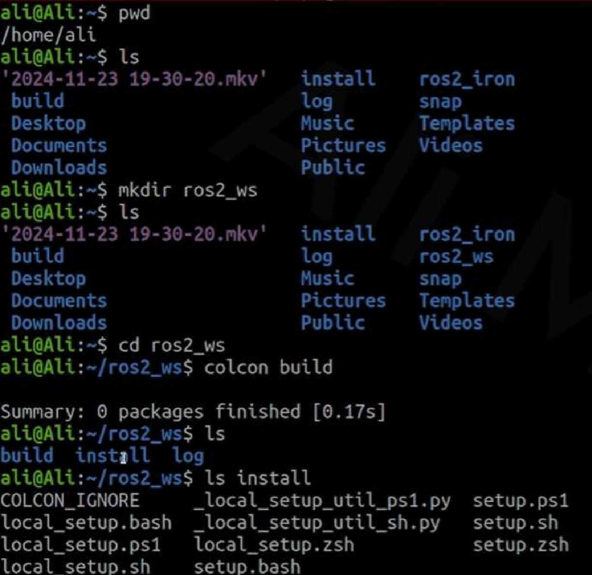

---

## 第 13 页

Building Workspace in ROS2

- Build now you first Packages: using colcon build

---

## 第 14 页

Building Packages in ROS2

- Every workspace can have serval packages. Each package

contains modules (codes that send and receives messages).

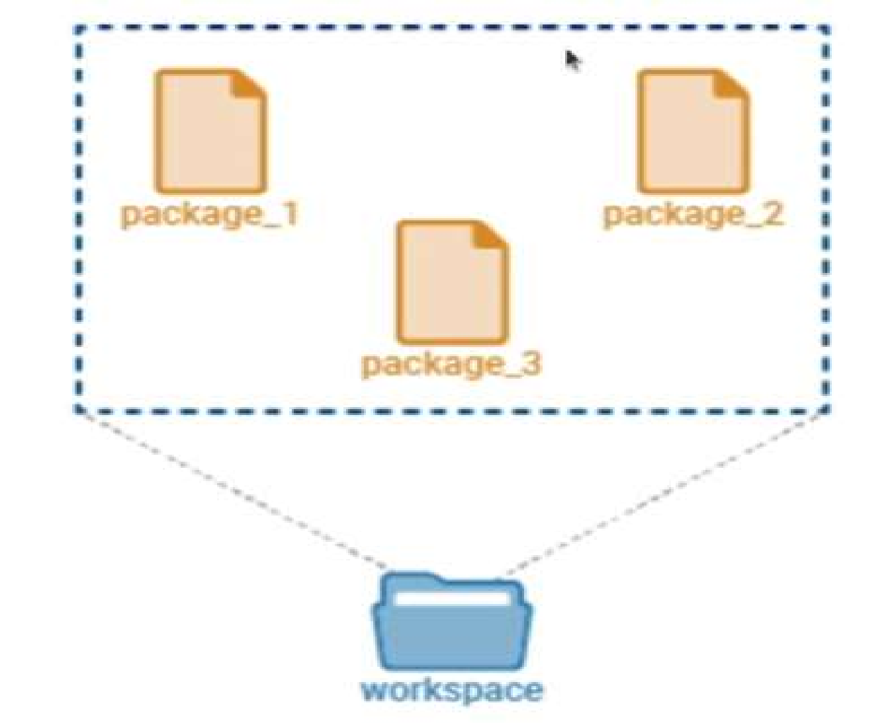

---

## 第 15 页

Building Packages in ROS2

- Every workspace can have serval packages. Each package

contains modules (codes that send and receives messages).

- You can build package a package called my_py_pkg using ament

as follows:

- Note that you need rclpy to be able to write pyhton codes.

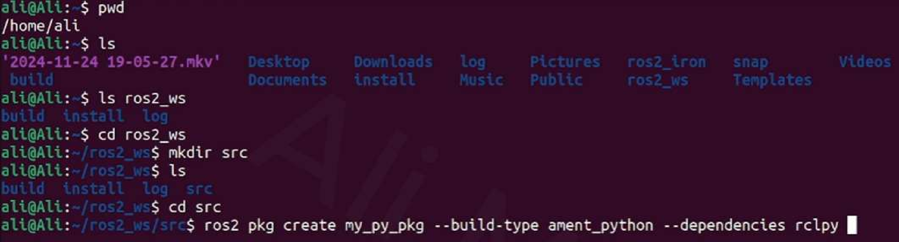

---

## 第 16 页

Building Packages in ROS2

- Every workspace can have serval packages. Each package

contains modules (codes that send and receives messages).

- You can build package a package called my_py_pkg using ament

as follows:

- Note that you need rclpy to be able to write pyhton codes.

---

## 第 17 页

Building Packages in ROS2

- Now check that your Python Package was build.
- You need to redo “colcon build” every time you install or update

any of the packages inside the workspace.

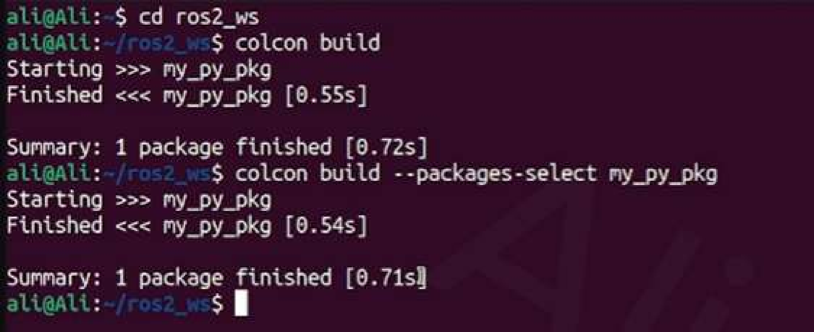

---

## 第 18 页

Building Nodes in ROS2

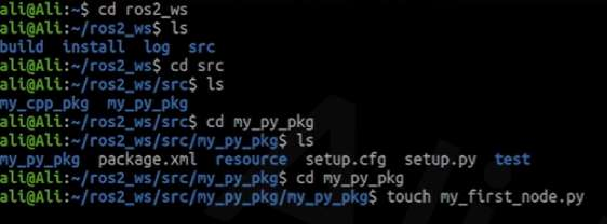

---

## 第 19 页

Building Nodes in ROS2

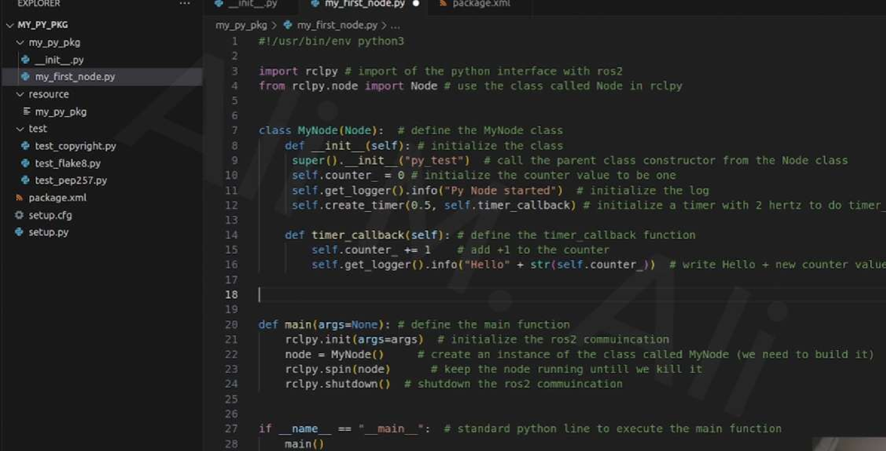

---
