# CST8504 08 Cont ROS2 Basics

*从PDF文档转换生成*

---

## 目录

- 122 +123

---

*注: 共提取了 18 张图片*

## 第 1 页

ROS2 _ Continue

---

## 第 2 页

Auto Sourcing your packages

- We need to edit the bashrc file

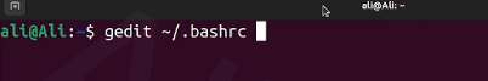

---

## 第 3 页

Add line 122 +123 and save the file

- Line 122 to auto

source humble

- Line 123 for the

autocomplete tool in Colcon ( using double tab )

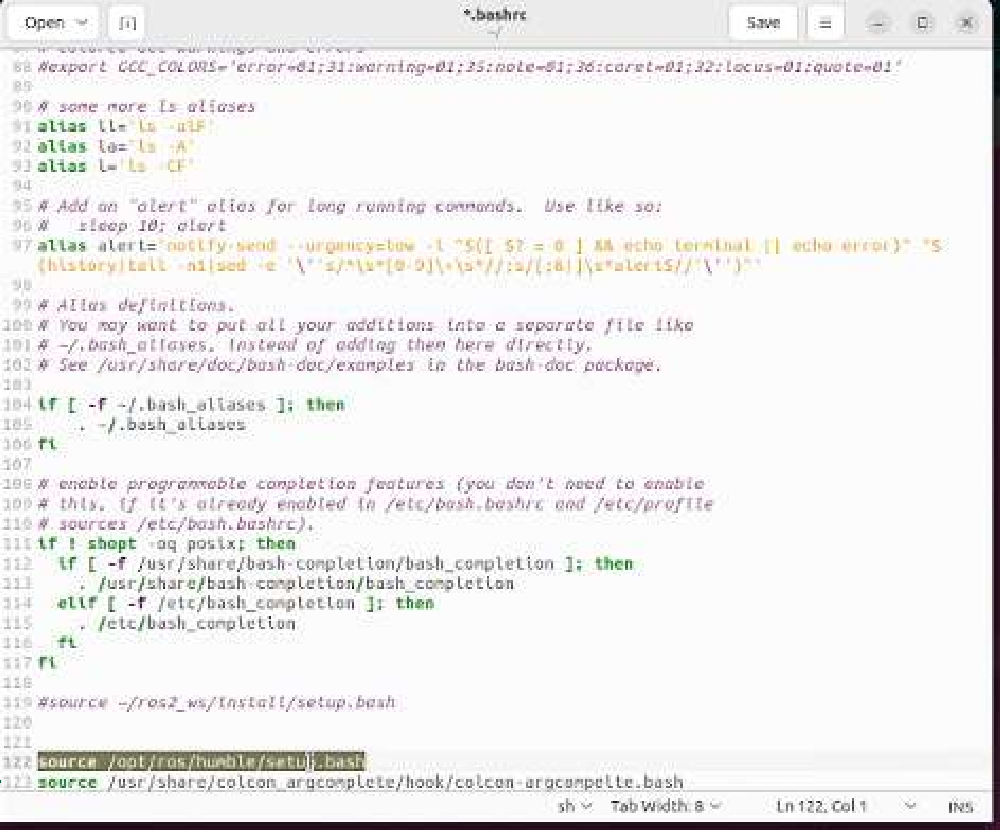

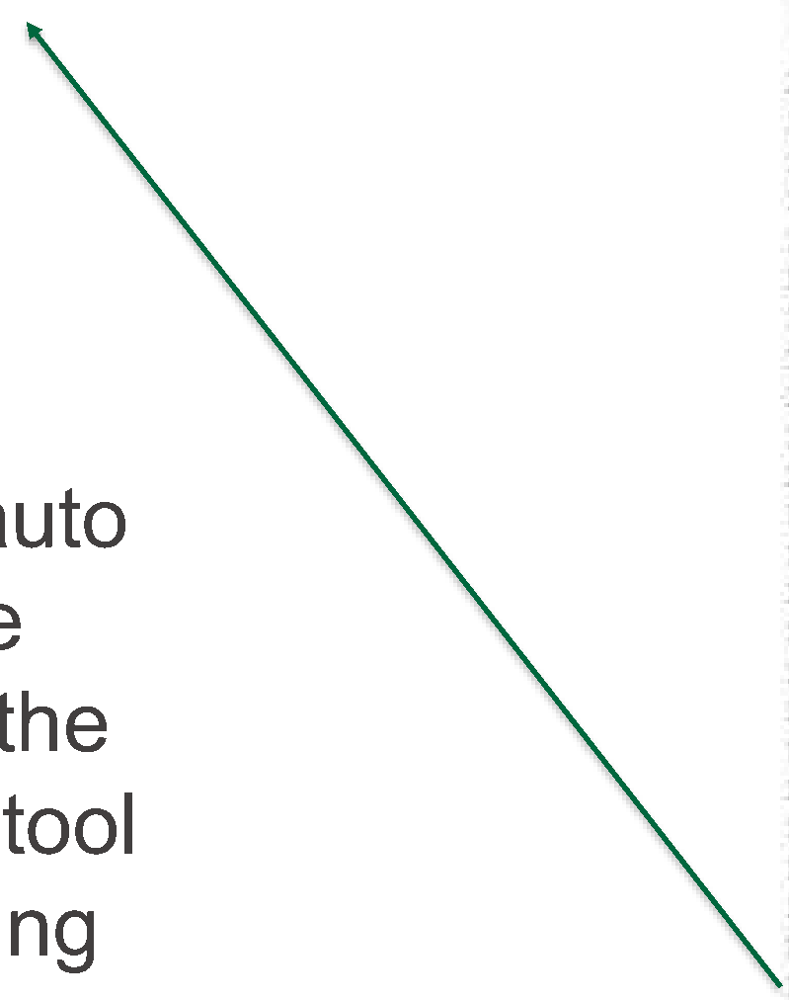

---

## 第 4 页

Terminator

- Install it using sudo apt in terminator. Type terminator and split the terminals.
- This will allow you to work on more than one terminal in an easier setting.

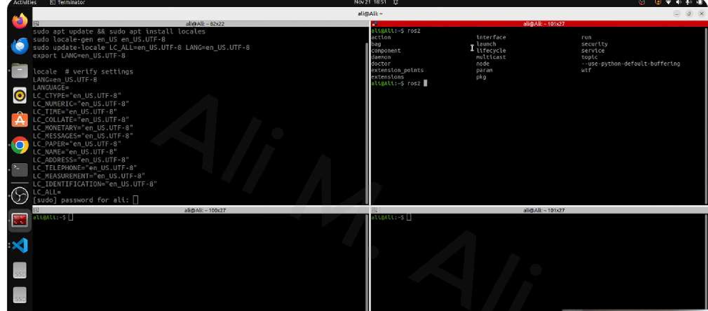

---

## 第 5 页

Nodes communication

- 1) Publish and subscribe with topics.
- 2) Service
- 3) Actions

---

## 第 6 页

1) Topics

- Recall the demo nodes in the pervious slides that prints hello world everything

second (Talker and Listener)

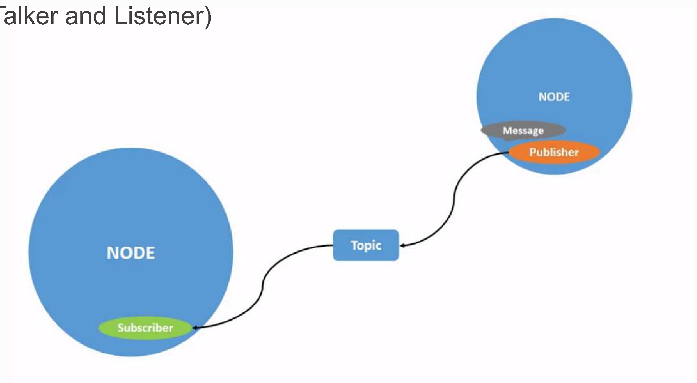

---

## 第 7 页

Rqt Graphs

- ros2 run rqt_graph rqt_graph
- It is used to visualize the communication between the nodes/packages

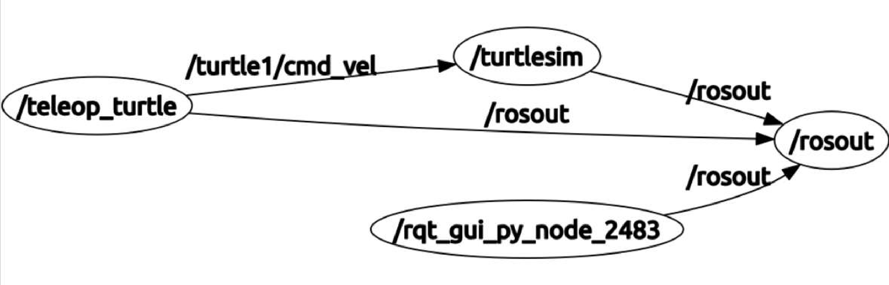

---

## 第 8 页

2) Service

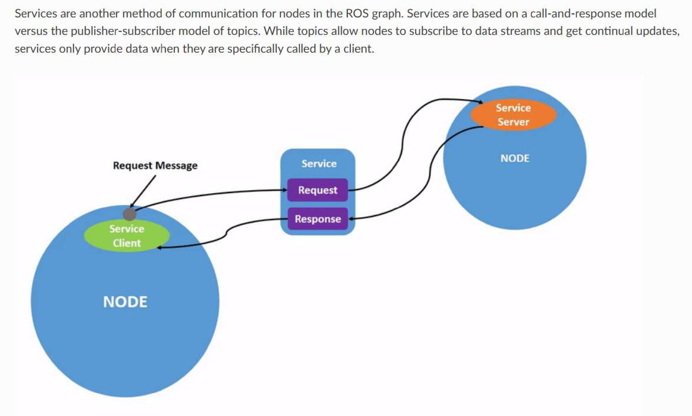

---

## 第 9 页

3) Action

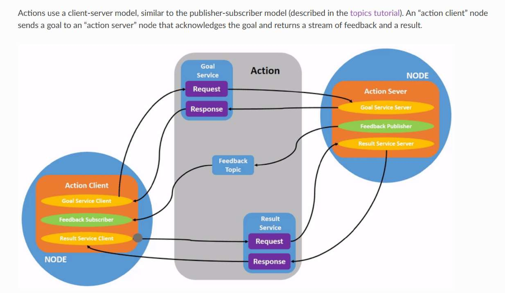

---

## 第 10 页

How to Install and Run your First Node ?

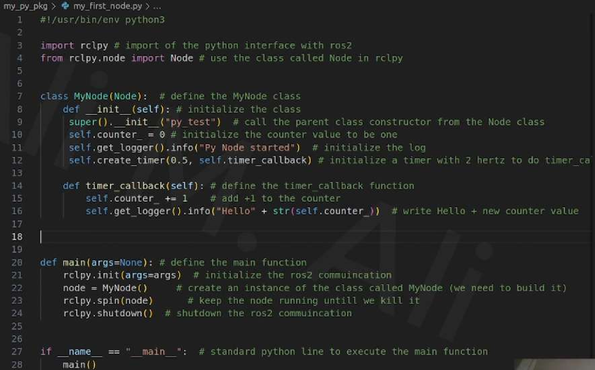

---

## 第 11 页

Running your First Node

- Make sure that you saved the code first.
- Then mark the code as an executable file as follows:

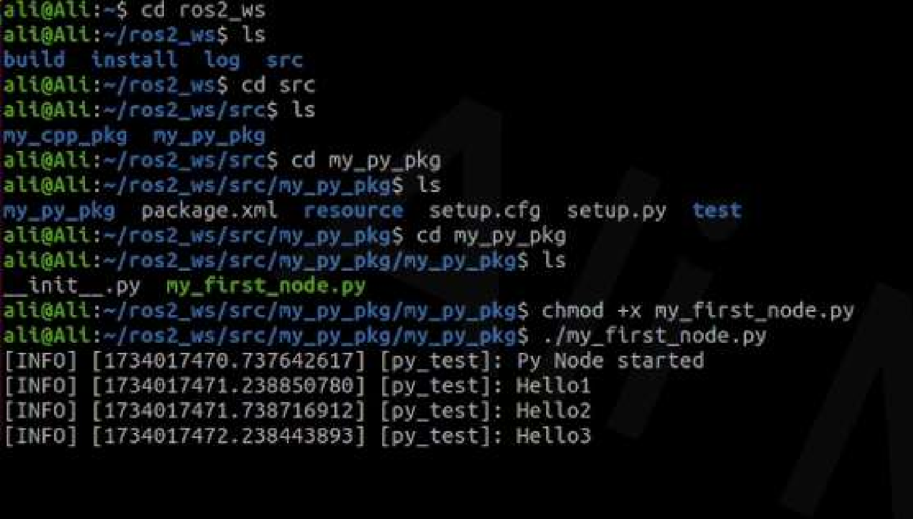

---

## 第 12 页

Installing your First Node

- Go to the setup code inside your IDE

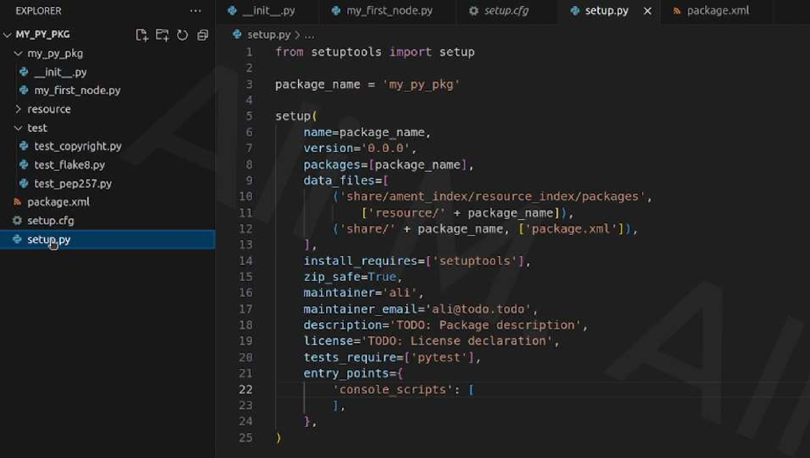

---

## 第 13 页

Installing your First Node Add this line ( see the green arrow). Don't forget to save the setup code.

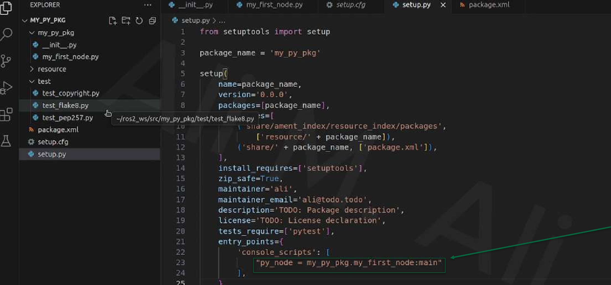

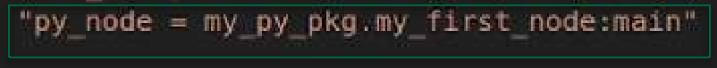

---

## 第 14 页

Installing your First Node

- We need to rebuild the package again after these modifications using Colcon

Build

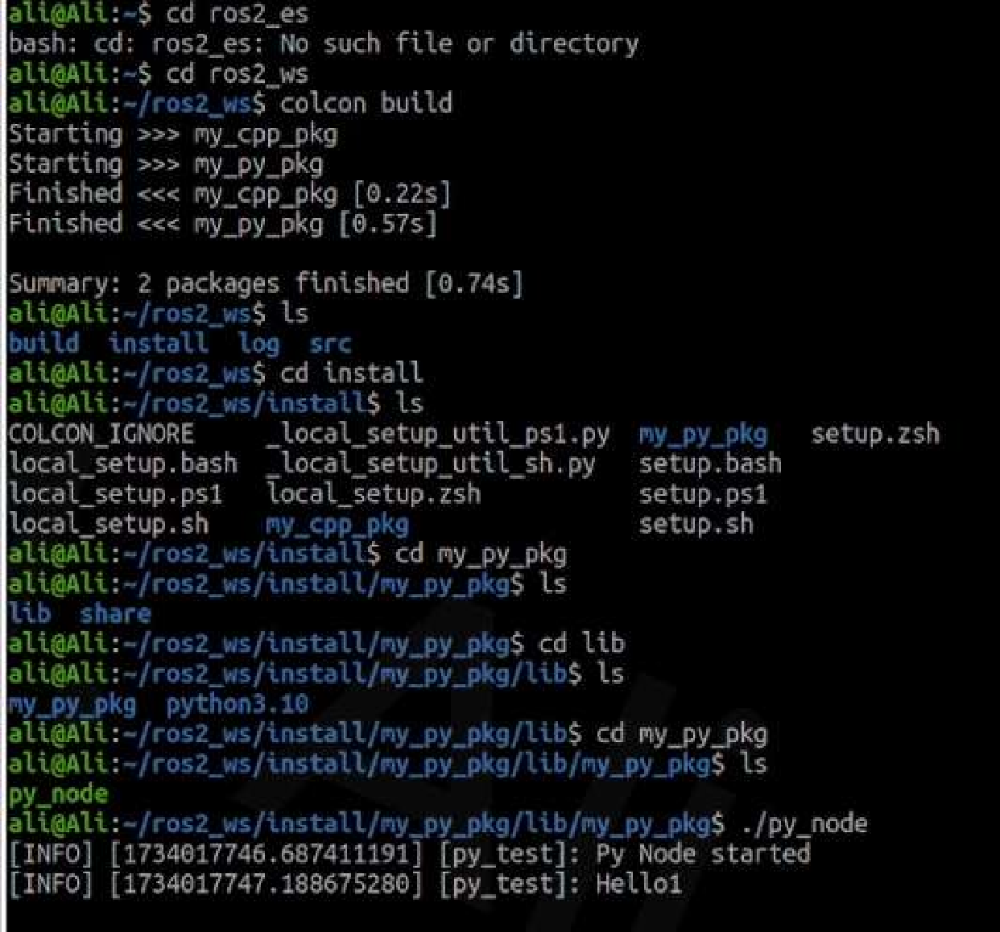

---

## 第 15 页

Installing your First Node

- Now Finally, we can run our custom build Node

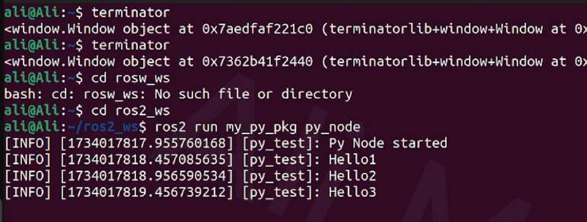

---
