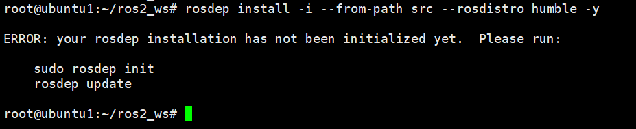
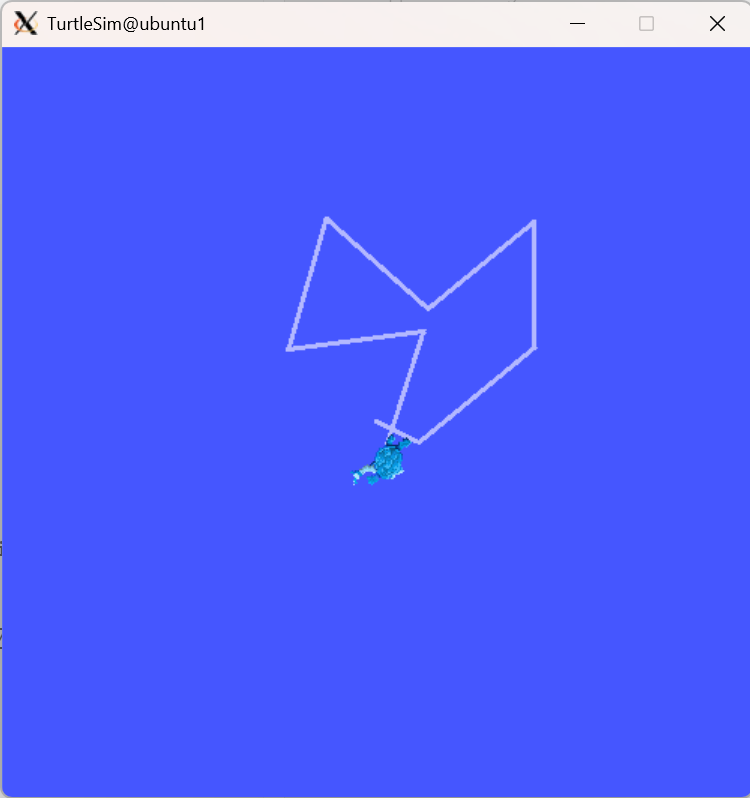

# CST8504 Lab 4 ROS2 Development Environment - Step Architecture Document

---

## Lab Objectives

After completing this lab, you will be able to:

- Install and configure X11 server on Windows
- Connect to virtual machine using SSH client (Putty or Xshell) with X11 forwarding enabled
- Install ROS2 Humble on Ubuntu virtual machine
- Create a ROS2 workspace
- Clone, build and run ROS2 tutorial examples (turtlesim simulator)

---

## Lab Step Architecture

### Phase 1: Windows Environment Setup

#### Step 1: Install VcXsrv X Server

**Objective:**

- Install X11 server on Windows to display graphical interface from virtual machine

**Actions:**

- Download VcXsrv from: https://sourceforge.net/projects/vcxsrv/
- Accept default settings during installation
- After installation, you will have Xlaunch program

---

#### Step 2: Configure SSH Client X11 Forwarding

**Objective:**

- Configure SSH client (Putty or Xshell) to support X11 graphical forwarding from VM to Windows

**Option A: Using Putty**

**Actions:**

- Open Putty configuration
- Path: `Connection -> SSH -> X11 -> Enable X11 forwarding`
- Save the profile (to avoid reconfiguration each time)
- Use IP address: 127.0.0.1 (VirtualBox NAT networking)

**Option B: Using Xshell**

**Actions:**

- Open Xshell session properties
- Path: `Connection -> SSH -> Tunneling` (or in Chinese interface: `连接 -> SSH -> 隧道`)
- In the right panel, find the `X11 Transfer` section (or `X11转移` in Chinese interface)
- Check the `Forward X11 connection to (X):` checkbox (or `转发X11连接到(X):` in Chinese interface)
- Select the `X DISPLAY(D):` option and set it to `localhost:0.0`
- Alternatively, if Xmanager is installed, you can select the `Xmanager(M)` option
- Save session configuration (to avoid reconfiguration each time)
- Use IP address: 127.0.0.1 (VirtualBox NAT networking)

**Notes:**

- In the `Tunneling` settings page (or `隧道` in Chinese interface), you can see the `X11 Transfer` section (or `X11转移` in Chinese interface) in the right panel
- If using VcXsrv, select the `X DISPLAY(D):` option and set it to `localhost:0.0`
- If Xmanager is installed, you can select the `Xmanager(M)` option
- Both Putty and Xshell can be used for X11 forwarding, choose one
- Ensure VcXsrv (XLaunch) is installed and running before use
- **If you see `/usr/bin/xauth: file /home/username/.Xauthority does not exist` warning when connecting**: This is normal, the file will be created automatically on first X11 forwarding use, does not affect functionality

---

### Phase 2: ROS2 Installation on VM

#### Step 3: Install ROS2 Humble

**Objective:**

- Install ROS2 Humble on Ubuntu-server 22.04 virtual machine

**Actions:**

- Follow official guide: https://iroboteducation.github.io/create3_docs/setup/ubuntu2204/

**Detailed Steps:**

**Step 1: Check Locale**

Ensure you are using a UTF-8 locale:

```bash
echo $LANG
```

Ensure "UTF-8" is at the end of the returned string. If not, you may need to set it.

**Step 2: Ensure Universe Repository is Enabled**

Check if Universe repository is enabled:

```bash
apt-cache policy | grep universe
```

Should output a line like:

```
500 http://us.archive.ubuntu.com/ubuntu jammy/universe amd64 Packages
  release v=22.04,o=Ubuntu,a=jammy,n=jammy,l=Ubuntu,c=universe,b=amd64
```

If it does not, execute:

```bash
sudo apt update && sudo apt install software-properties-common && sudo add-apt-repository universe
```

**Step 3: Add ROS 2 Repository**

First, install curl:

```bash
sudo apt install curl
```

Then authorize the Open Robotics GPG key:

```bash
sudo curl -sSL https://raw.githubusercontent.com/ros/rosdistro/master/ros.key -o /usr/share/keyrings/ros-archive-keyring.gpg
```

Add the repository to your sources list:

```bash
echo "deb [arch=$(dpkg --print-architecture) signed-by=/usr/share/keyrings/ros-archive-keyring.gpg] http://packages.ros.org/ros2/ubuntu $(source /etc/os-release && echo $UBUNTU_CODENAME) main" | sudo tee /etc/apt/sources.list.d/ros2.list > /dev/null
```

**Step 4: Update Package Lists**

After adding the ROS 2 repository, update the package lists:

```bash
sudo apt update
```

**Step 5: Upgrade Other Packages**

Make sure your other packages are up to date:

```bash
sudo apt upgrade
```

**Note:** During `apt upgrade`, you may see a dialog asking "Which services should be restarted?" for daemons using outdated libraries. You can:

- Accept the default selections (most services are pre-selected)
- Click `<Ok>` to proceed
- Or click `<Cancel>` if you prefer to restart services manually later

**Step 6: Install ROS 2**

- **Key Choice 1:** Choose to install `ros-humble-ros-base` (without GUI tools, for server installation)

```bash
sudo apt install -y ros-humble-ros-base
```

**Note:** If you have a graphical user environment, you can use `ros-humble-desktop` instead:

```bash
sudo apt install -y ros-humble-desktop
```

**Step 7: Install iRobot Create Messages**

Install iRobot Create3 messages package:

```bash
sudo apt install -y ros-humble-irobot-create-msgs
```

**Step 8: Install Recommended Packages**

Install build tools and other recommended packages:

```bash
sudo apt install -y build-essential python3-colcon-common-extensions python3-rosdep ros-humble-rmw-cyclonedds-cpp
```

**Note:** This installs `ros-humble-rmw-cyclonedds-cpp` as one option. You can also use `rmw_fastrtps_cpp` (which is the default for Humble).

**Step 9: Set Environment Variables**

Add ROS 2 setup to your shell initialization file:

```bash
echo "source /opt/ros/humble/setup.bash" >> ~/.bashrc
```

**Step 10: Set RMW Implementation**

- **Key Configuration 1:** Set RMW environment variable. The RMW you set here should match the RMW on your robot.

**Option A: Use rmw_fastrtps_cpp (default for Humble)**

```bash
echo "export RMW_IMPLEMENTATION=rmw_fastrtps_cpp" >> ~/.bashrc
```

**Option B: Use rmw_cyclonedds_cpp**

```bash
echo "export RMW_IMPLEMENTATION=rmw_cyclonedds_cpp" >> ~/.bashrc
```

**Step 11: Apply Changes**

Either log out and log back in, or simply:

```bash
source ~/.bashrc
```

**Step 12: Verify Installation**

Test ROS 2 installation:

```bash
ros2 --help
```

Verify RMW configuration:

```bash
echo $RMW_IMPLEMENTATION
```


Should display the RMW you configured (e.g., `rmw_fastrtps_cpp` or `rmw_cyclonedds_cpp`).

**Notes:**

- Use SSH client (Putty or Xshell) to copy-paste commands to VM
- Putty: Right-click or middle-click to paste
- Xshell: Right-click to paste or use Ctrl+V

---

### Phase 3: ROS2 Workspace Setup

#### Step 4: Create ROS2 Workspace

**Objective:**

- Create workspace for ROS2 project development

**Reference:**

- Follow ROS2 official tutorial: https://docs.ros.org/en/humble/Tutorials/Beginner-Client-Libraries/Creating-A-Workspace/Creating-A-Workspace.html

**Detailed Steps:**

**Step 4.1: Set Up Environment**

Ensure ROS 2 environment is sourced. Since you added it to `~/.bashrc` in Phase 2, it should be automatically sourced. If not, run:

```bash
source /opt/ros/humble/setup.bash
```

**Step 4.2: Create Workspace Directory Structure**

Create a new directory for your workspace. Best practice is to create a new directory for every new workspace:

```bash
mkdir -p ~/ros2_ws/src
cd ~/ros2_ws/src
```

This creates a `src` directory inside `ros2_ws` where you will put your packages.

---

#### Step 5: Clone ROS2 Tutorial Examples Repository

**Objective:**

- Obtain ROS2 tutorial example code (including turtlesim simulator)

**Detailed Steps:**

**Step 5.1: Clone Tutorial Repository**

Ensure you're still in the `ros2_ws/src` directory, then clone the tutorial repository:

```bash
git clone https://github.com/ros/ros_tutorials.git -b humble
```

**Note:** The `-b humble` argument ensures you get the branch that matches your ROS 2 distribution (Humble).

The `ros_tutorials` repository contains the `turtlesim` package, which we'll use in this lab. Other packages in this repository are not built because they contain a `COLCON_IGNORE` file.

---

#### Step 6: Build turtlesim Package

**Objective:**

- Resolve dependencies and compile turtlesim simulator

**Detailed Steps:**

**Step 6.1: Resolve Dependencies**

Before building the workspace, you need to resolve package dependencies.

**Step 6.1.1: Initialize rosdep (First Time Only)**

If this is your first time using `rosdep`, you need to initialize it first. If you see the error:

```
ERROR: your rosdep installation has not been initialized yet. Please run:
```



Run these commands to initialize rosdep:

```bash
sudo rosdep init
rosdep update
```

**Note:**

- `sudo rosdep init` only needs to be run once per system (creates `/etc/ros/rosdep/sources.list.d/20-default.list`)
- `rosdep update` updates the local database of package definitions
- If you get a "permission denied" error on `sudo rosdep init`, it may already be initialized. You can skip this step and just run `rosdep update`

**Step 6.1.2: Install Package Dependencies**

From the root of your workspace (`ros2_ws`), run:

```bash
cd ~/ros2_ws
rosdep install -i --from-path src --rosdistro humble -y
```

**Note:**

- If you see "All required rosdeps installed successfully", you're ready to build
- If there are missing dependencies, they will be installed automatically
- The `-i` flag means "ignore missing packages", `--from-path src` specifies the source directory, `--rosdistro humble` specifies the ROS distribution, and `-y` automatically confirms installations

**Step 6.2: Build the Workspace**

From the root of your workspace (`~/ros2_ws`), build your packages using colcon:

```bash
colcon build
```

**Expected Output:**

```
Starting >>> turtlesim
Finished <<< turtlesim [5.49s]

Summary: 1 package finished [5.58s]
```

**Useful colcon build arguments:**

- `--packages-up-to <package_name>`: Build the package you want, plus all its dependencies, but not the whole workspace (saves time)
- `--symlink-install`: Saves you from having to rebuild every time you tweak python scripts
- `--event-handlers console_direct+`: Shows console output while building

**Step 6.3: Verify Build Output**

After the build completes, check the workspace structure:

```bash
ls
```

You should see these directories:

- `build/`: Build space for CMake to build packages
- `install/`: Install space where packages are installed
- `log/`: Log information
- `src/`: Source space where your source code resides

**Step 6.4: Source the Overlay**

**Important:** Open a **new terminal** (separate from the one where you built the workspace). Sourcing an overlay in the same terminal where you built may create complex issues.

In the new terminal:

1. Source your main ROS 2 environment (the "underlay"):

```bash
source /opt/ros/humble/setup.bash
```

2. Navigate to the workspace root:

```bash
cd ~/ros2_ws
```

3. Source your overlay:

```bash
source install/local_setup.bash
```

**Note:**

- `local_setup.bash` sources only the packages in your overlay
- `setup.bash` sources both the overlay and the underlay
- Sourcing `/opt/ros/humble/setup.bash` and then `ros2_ws/install/local_setup.bash` is equivalent to just sourcing `ros2_ws/install/setup.bash`

**Step 6.5: Verify turtlesim is Available**

Test that turtlesim is available from your workspace:

```bash
ros2 run turtlesim turtlesim_node
```

You should see the turtlesim window appear (if X11 forwarding is configured correctly). Press `Ctrl+C` to stop it.

**Note:** If you see the turtlesim window, it means your workspace overlay is working correctly. The overlay takes precedence over the underlay, so you're running turtlesim from your workspace, not from the system installation.

**Troubleshooting:** If you see Qt/X11 display errors instead of the turtlesim window, see **Issue 1** in the Common Issues section below.

---

### Phase 4: Execution and Verification

#### Step 7: Launch Xlaunch (Windows Side)

**Objective:**

- Start X11 server to receive graphical display

**Actions:**

- Run Xlaunch program on main laptop
- **Must be started before running turtlesim**

---

#### Step 8: Login to VM using SSH Client (with X11 enabled)

**Objective:**

- Establish SSH connection with graphical forwarding support

**Actions:**

- Login using SSH client (Putty or Xshell) profile with X11 forwarding configured
- Verify X11 forwarding is working properly

---

#### Step 9: Run turtlesim Simulator

**Objective:**

- Run turtlesim simulator and verify graphical interface display
- Control the turtle using keyboard input

**Detailed Steps:**

**Step 9.1: Start turtlesim Node**

Open the first terminal (or SSH session) and ensure the environment is sourced:

```bash
source /opt/ros/humble/setup.bash
source ~/ros2_ws/install/setup.bash
```

Then run the turtlesim simulator:

```bash
ros2 run turtlesim turtlesim_node
```

You should see the turtlesim window appear (if X11 forwarding is configured correctly). The window will show a turtle in the center.

**Note:** Keep this terminal window open and running. Press `Ctrl+C` to stop it when you're done.

**Step 9.2: Control the Turtle with Keyboard**

Open a **second terminal** (or SSH session) and ensure the environment is sourced:

```bash
source /opt/ros/humble/setup.bash
source ~/ros2_ws/install/setup.bash
```

Then run the keyboard control program:

```bash
ros2 run turtlesim turtle_teleop_key
```

**Step 9.3: Use Keyboard Controls**

- Make sure the second terminal (with `turtle_teleop_key`) is focused/active
- Use arrow keys to control the turtle:
  - `↑` arrow: Move forward
  - `↓` arrow: Move backward
  - `←` arrow: Turn left
  - `→` arrow: Turn right
  - `Space` + arrow keys: Move in a straight line
- Press `Ctrl+C` in the second terminal to stop the teleop program

**Note:**

- You need **two separate terminals**:
  1. First terminal: runs `turtlesim_node` (displays the graphical window)
  2. Second terminal: runs `turtle_teleop_key` (receives keyboard input)
- The second terminal must be focused/active to receive keyboard input
- If the turtle doesn't move, check that the second terminal is selected and try again

**Troubleshooting:** If you see Qt/X11 display errors instead of the turtlesim window, see **Issue 1** in the Common Issues section below.

---


