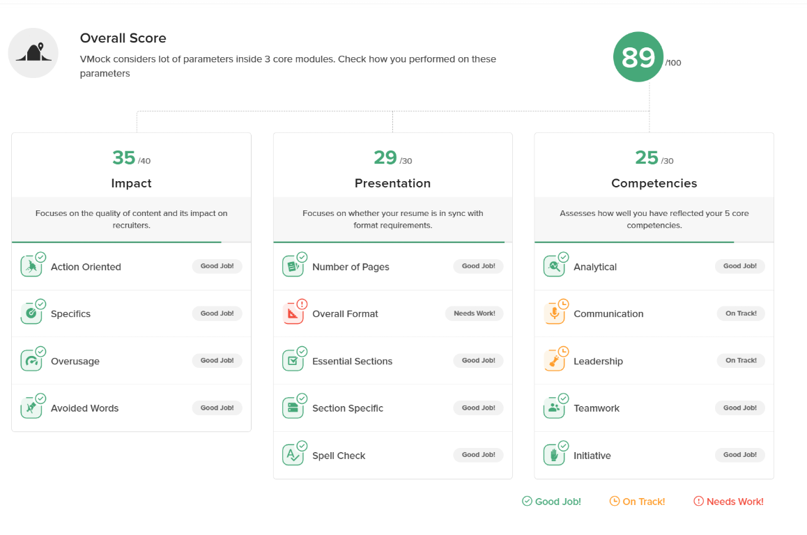

# Job Application Package - Peng Wang

# Resume - Peng Wang

## Peng Wang

753-881-8089 | wang1059@algonquinlive.com

[LinkedIn Profile](https://www.linkedin.com/feed/) | [GitHub Profile](https://github.com/zhizhunbao)

## PROFILE

Full-Stack AI Developer with 10+ years in data engineering and software development, proficient in React/Vue, Python/Java, big data, and cloud operations. Currently pursuing AI graduate studies with hands-on experience in machine learning and knowledge representation. **Philosophy: simplicity over complexity** — architect robust systems that maximize impact through clarity and elegance.

## SUMMARY OF QUALIFICATIONS

### Technical Skills

- **Backend & AI**: Proficient in Python, Java, Spring Boot; engineered FastAPI backend with 88.8% test coverage; integrated AI services (Groq, Google Gemini, scikit-learn) achieving 85%+ accuracy
- **Cloud & Microservices**: Extensive experience with Docker, Kubernetes, AWS; engineered RESTful APIs and microservices with OAuth 2.0; deployed production systems with CI/CD pipelines
- **Big Data & Infrastructure**: Operated Hadoop ecosystems, Spark pipelines processing 50+ TB monthly with 38 data sources, ensuring 99.9% uptime
- **Agile & Leadership**: Led Scrum implementations across cross-functional teams; coordinated 21+ concurrent projects; mentored teams from 5 to 20+ members

## EDUCATION

**Ontario College Graduate Certificate** 2025 – 2026
Algonquin College, Ottawa, ON
Artificial Intelligence Software Development

**Bachelor of Engineering in Communication Engineering** 2008 – 2012
Hubei University of Technology, Wuhan, China

## ACADEMIC PROJECTS

**Ottawa GenAI Research Assistant** Sep 2025 - Present
Collaborative Government Project | [GitHub Repository](https://github.com/zhizhunbao/ottawa-genai-research-assistant)

- Led enterprise-grade AI research assistant with bilingual support (EN/FR) for Ottawa Economic Development
- Engineered FastAPI backend with 88.8% test coverage, integrating Groq AI and Google Gemini
- Deployed microservices on Render with CI/CD and OAuth 2.0 authentication

**Multi-Course Learning & Exam System** Sep 2025 - Present
Independent Development Project | [Live Demo](https://zhizhunbao.github.io/multi-course-learning-exam-system/) | [GitHub Repository](https://github.com/zhizhunbao/multi-course-learning-exam-system)

- Built comprehensive learning platform using React, Vite, and Tailwind CSS with learning, practice, lab, and exam modules
- Integrated AI-powered content generation using Google Gemini API to auto-generate materials from PDFs
- Launched admin dashboard with role-based access control on GitHub Pages

**Python Data Basics Learning Platform** Sep 2025 - Present
Educational Project | [Live Demo](https://zhizhunbao.github.io/python-data-basics/#/business) | [GitHub Repository](https://github.com/zhizhunbao/python-data-basics)

- Built Python data processing platform with NumPy, Pandas, and Matplotlib
- Created interactive learning modules with MDX, Monaco Editor for real-time code execution
- Designed comparison-based learning approach demonstrating data analysis workflow

## WORK EXPERIENCE

**Data Architect** Apr 2015 - Oct 2023
Guangzhou Huanwang Technology Co., Ltd., Guangzhou, China

- Architected big data platform processing 50+ TB monthly with 38 data sources, ensuring 99.9% uptime using Spark, CDH, and DolphinScheduler
- Coordinated cross-functional agile teams using Scrum to deliver 21+ concurrent projects on time and within budget
- Cultivated technical teams from 5 to 20+ members, providing mentorship and conducting code reviews

**Java Developer** Oct 2012 - Mar 2015
Beijing Haitian Network Marketing Planning Co., Ltd., Beijing, China

- Delivered core modules for enterprise OA system serving 200+ internal users, improving query performance by 35% through SQL optimization
- Automated deployment pipelines and managed server infrastructure supporting MySQL and Oracle databases, reducing manual deployment time by 40%
- Collaborated in agile Scrum teams to deliver high-quality code through pair programming and code reviews

# VMock Resume Feedback Report

# Cover Letter - Peng Wang

**Peng Wang**
753-881-8089 | wang1059@algonquinlive.com
[LinkedIn Profile](https://www.linkedin.com/feed/) | [GitHub Profile](https://github.com/zhizhunbao)

**Date**: January 15, 2025

**Hiring Manager**
Intact Financial Corporation
Intact Lab
Ottawa, ON

**Re: AI Backend Developer Co-op Position - Winter 2025**

Dear Hiring Manager,

I am writing to express my strong interest in the AI Backend Developer Co-op position at Intact Lab. As a graduate student pursuing Artificial Intelligence Software Development at Algonquin College with 10+ years of experience in data engineering and full-stack development, I am excited about the opportunity to contribute to Intact's mission of transforming customer experience through innovative AI solutions.

**Alignment with Position Requirements**

Your position demands expertise in Python, Java, Docker/Kubernetes, and modern backend technologies—all areas where I have extensive hands-on experience. Throughout my career as a Data Architect at Guangzhou Huanwang Technology, I architected and maintained comprehensive big data platforms processing 50+ TB monthly, using Spring Boot, Docker, and distributed systems to ensure 99.9% uptime. I led cloud infrastructure optimization, implementing automated monitoring and CI/CD pipelines.

**Relevant Technical Expertise**

In my current studies at Algonquin College, I have actively applied these technologies to real-world AI projects. Most notably, I led the development of the Ottawa GenAI Research Assistant, a government collaboration project where I architected a FastAPI backend with 88.8% test coverage, integrated Groq AI and Google Gemini for intelligent content generation, and deployed a microservices architecture on Render with CI/CD validation. This project demonstrates my ability to design, test, and develop backend solutions for AI teams—exactly the core responsibility of your position.

Additionally, I have built multiple full-stack applications using Python, Java, React, and modern cloud technologies, including a Multi-Course Learning & Exam System that leverages Google Gemini API for AI-powered content generation. I am proficient in Python and Java programming, with practical experience in Docker/Kubernetes and agile methodologies such as Scrum.

**Cultural Fit and Growth Mindset**

I am particularly drawn to Intact Lab's culture of innovation, where exploration and continuous learning are valued. The opportunity to work alongside talented engineers on AI solutions that serve millions of Canadians aligns perfectly with my passion for using technology to solve real-world problems. My experience leading cross-functional agile teams and mentoring developers has prepared me to collaborate effectively in a fast-paced, innovative environment.

**Availability and Commitment**

I am available to work full-time (35 hours per week) for the Winter 2025 term (January – April) and am enthusiastic about the prospect of growing with the Intact family. I am eager to bring my technical expertise, collaborative mindset, and dedication to supporting AI teams in developing innovative backend solutions.

Thank you for considering my application. I look forward to discussing how my background in AI development, backend engineering, and full-stack solutions can contribute to the success of Intact Lab.

Sincerely,

**Peng Wang**
