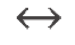

# CST8503 09 KR Logic

_从 PDF 文档转换生成_

---

## 目录

- 真值表示例

---

_注: 共提取了 2 张图片_

## 第 1 页

### Knowledge Representation: Logic


**通俗解释：** 这一页是课程的开头，介绍了知识表示（Knowledge Representation）和逻辑（Logic）这两个核心概念。知识表示是人工智能中如何用计算机能够理解和处理的方式来表达知识，而逻辑则是一种严格的、形式化的推理方法。简单来说，就像我们要用数学公式来表达数学问题一样，我们需要用逻辑来表达和推理知识。

---

## 第 2 页

### Knowledge Representation Languages Mathematical Logic Hierarchy

- Proposition Calculus (0th order)

  No variables or quantifiers

  Propositions together with logical connectives

- Predicate Calculus (1st order)

  Adds Variables for terms, and quantification

- Second Order Logics (2nd order)

  Adds variables for predicates

**通俗解释：** 这一页介绍了逻辑系统的三个层次，就像搭积木一样，从简单到复杂：

- **零阶逻辑（命题演算）**：最基础的层次，只能处理简单的真假命题，比如"今天下雨"或"今天不下雨"，不能使用变量。就像只能判断单个事实的真假。

- **一阶逻辑（谓词演算）**：在零阶基础上增加了变量和量词（"所有"、"存在"），可以表达更复杂的关系，比如"所有人都会死"。这是最常用的逻辑系统。

- **二阶逻辑**：更高级的层次，可以对谓词本身进行量化，表达能力更强但也更复杂。就像可以对"关系"这个概念本身进行讨论。

---

## 第 3 页

### Propositional Calculus

- Propositions are true or false

  The moon is made of cheese

  Socrates is a man

  Men are mortal

  The population of the world is 3 million

- Questions are not propositions

  What is the meaning of life, the universe, and everything?

  Where is the door?

**通俗解释：** 这一页解释了什么是命题（Proposition）。命题就像是一个可以判断真假的陈述句：

- **是命题的例子**：这些句子都有明确的真假值，比如"月亮是奶酪做的"（假）、"苏格拉底是人"（真）、"人会死"（真）等。不管真假，它们都是命题。

- **不是命题的例子**：问题、命令、感叹等不能判断真假的句子都不是命题。比如"生命的意义是什么？"这个问题没有真假之分，所以不是命题。

简单记忆：能说"这是真的"或"这是假的"的句子才是命题。

---

## 第 4 页

### Propositional Calculus (cont'd)

Propositional Calculus or Propositional Logic is about propositions and their combinations

Combine Propositions with logical connectives:

- ¬ not (negation)
- ∨ or (disjunction)
- ∧ and (conjunction)
- → implies (conditional)
- ↔ equivalence (bi-conditional)



**通俗解释：** 这一页介绍了逻辑连接符，就像数学中的加减乘除一样，用来组合命题：

- **¬（非）**：表示否定，比如"不下雨"就是"下雨"的否定
- **∨（或）**：表示"至少一个为真"，比如"今天下雨或明天下雨"
- **∧（与）**：表示"两个都为真"，比如"今天下雨且明天也下雨"
- **→（蕴含）**：表示"如果...那么..."，比如"如果下雨，那么地会湿"
- **↔（等价）**：表示"当且仅当"，两个命题真假相同，比如"今天是星期一当且仅当明天是星期二"

这些连接符就像积木的接口，可以把简单的命题组合成复杂的逻辑表达式。

---

## 第 5 页

### Truth Tables

How logical are humans?

Truth tables show the truth value of propositions and their combinations

We can use symbols like p and q to represent propositions

```
P Q P→ Q
T T T
T F F
F T T
F F T
```

**通俗解释：** 这一页介绍了真值表（Truth Table），这是逻辑学中最重要的工具之一。真值表就像一张"所有可能情况的对照表"：

- 用 P 和 Q 代表两个命题（比如"今天下雨"和"我带伞"）
- 列出所有可能的真假组合（TT, TF, FT, FF）
- 计算在这些情况下，组合后的命题（如 P→Q）的真假值

**蕴含（→）的真值表**：

- 当 P 真 Q 真时，P→Q 为真（如果下雨且带伞，那么"如果下雨则带伞"是对的）
- 当 P 真 Q 假时，P→Q 为假（如果下雨但没带伞，那么"如果下雨则带伞"是错的）
- 当 P 假时，无论 Q 是什么，P→Q 都为真（这个有点反直觉，后面会详细解释）

真值表帮助我们系统地理解逻辑连接符的含义。

---

## 第 6 页

### Logical Equivalence

It turns out we don't need all of the connectives

Truth table proves P→ Q is logically equivalent to ¬P ∨ Q

There is no way to assign values to P or Q to make these two formulas (formulae) different

```
P Q P→ Q ¬P ∨ Q
T T T    T
T F F    F
F T T    T
F F T    T
```

**通俗解释：** 这一页展示了逻辑等价（Logical Equivalence）的概念。两个逻辑表达式是等价的，意味着它们在所有情况下都有相同的真假值。

**重要发现**：`P→Q` 和 `¬P ∨ Q` 是等价的！

- 用自然语言理解：`P→Q` 意思是"如果 P 则 Q"
- `¬P ∨ Q` 意思是"非 P 或 Q"，也就是"P 为假，或者 Q 为真"
- 这两个说法在所有情况下都给出相同的结果（看真值表，两列完全一样）

**实际意义**：这意味着我们不需要所有的连接符！可以用"非"和"或"来表示"蕴含"。就像数学中可以用加法和减法来表示所有运算一样。

---

## 第 7 页

### When P is False

Many of us have some trouble with the last line of the previous truth table:

```
P Q P→ Q
F F T
```

Our intuition tells us that so much falsity in P and Q cannot result in truth?

Explanation: P->Q is not as strong as our human intuition wants to make it. It's saying that if P is true, then there is more to the story. But if P is false, you can stop reading, the story is already finished, in that we know the overall statement is true.

**通俗解释：** 这一页解释了一个让很多人困惑的问题：为什么当 P 和 Q 都为假时，`P→Q` 却是真的？

**关键理解**：逻辑中的"蕴含"（→）比我们日常理解的"因果关系"要弱得多。

- **日常理解**：我们习惯认为"如果 P 则 Q"意味着 P 和 Q 之间有因果关系
- **逻辑定义**：`P→Q` 只是说"如果 P 为真，那么 Q 为真"。如果 P 本身为假，这个条件就"没有生效"，整个语句自动为真

**类比**：就像说"如果我是超人，那么我会飞"。因为"我是超人"是假的，所以这个条件语句本身是真的（因为没有违反任何规则）。逻辑中的蕴含不关心因果关系，只关心真假值的组合。

---

## 第 8 页

### When P is False (cont'd)

Think of the following P->Q, F -> F statement, which is true:

If 2 < 1 then all humans are extremely wealthy

Our human intuition wants to say, no it's not true, because "making" 2 < 1 true would not cause humans to be wealthy, the concepts are unrelated

After we get used to it, we can see that 2<1 is simply false, and it doesn't make sense to imagine "making" it true. The "making" it true is not part of the statement (it's a weak statement).

Our intuition wants to draw a causal relationship between "making" P true, and causing Q (all humans to be wealthy).

Our intuition wants to say "no such relationship exists" so "false"

Logic says if P is false, then the statement is true and it doesn't matter what Q is

**通俗解释：** 这一页用一个具体例子继续解释为什么 `F→F` 为真：

**例子**："如果 2 < 1，那么所有人都非常富有"

- **直觉反应**：我们会说"不对！2 < 1 是假的，而且它和人类富有没有关系，所以这个语句应该是假的"
- **逻辑观点**：因为"2 < 1"本身就是假的，所以这个条件语句没有"生效"，整个语句为真

**关键区别**：

- **直觉**：我们想找因果关系，认为"让 P 为真会导致 Q 为真吗？"如果答案是否定的，就认为整个语句为假
- **逻辑**：只关心真假值。如果前提 P 为假，条件语句就自动为真，不管 Q 是什么，也不管它们之间有没有关系

**记住**：逻辑中的蕴含是"弱"的，它不要求因果关系，只要求真假值的组合符合定义。

---

## 第 9 页

### Why Do We Care About Logic?

- Propositional Calculus is a tool that allows us to derive conclusions from combinations of simpler statements known to be true

- We are seeing the workings of a system where we can

  Make statements that we know to be true

  The logical entailments of those statements are also true

  Prolog systematically finds logical entailments

**通俗解释：** 这一页回答了"为什么我们需要学习逻辑？"这个重要问题：

**逻辑的作用**：

1. **从已知推导未知**：如果我们知道一些简单的事实为真，可以用逻辑规则推导出其他必然为真的事实

   - 比如：如果知道"所有人都会死"和"苏格拉底是人"，可以推导出"苏格拉底会死"

2. **建立可靠的推理系统**：

   - 我们输入一些已知为真的语句（前提）
   - 系统可以自动找出所有逻辑上必然为真的结论（逻辑蕴含）
   - 这些结论是可靠的，因为它们是逻辑推导出来的

3. **Prolog 的实际应用**：Prolog 编程语言就是基于这个原理工作的。你给它一些事实和规则，它会自动找出所有可能的结论。这就是为什么逻辑在人工智能中如此重要——它让我们能够进行自动推理。

**简单说**：逻辑让我们能够"自动思考"，从已知事实推导出新的知识。

---

## 第 10 页

### Time to Check Your Learning!

Let's see how many key concepts from propositional calculus you recall by filling in the truth table:

```
P Q P→ Q ¬P ∨ Q
T T
T F
F T
F F
```

**通俗解释：** 这是一个练习题，用来检验你对命题演算的理解。你需要填写真值表：

**提示**：

- 根据第 5 页的真值表，填写 `P→Q` 列
- 根据第 6 页的内容，`P→Q` 和 `¬P ∨ Q` 是等价的，所以两列应该相同
- 记住：当 P 为假时，`P→Q` 为真（无论 Q 是什么）

**答案**：

- 第一行（T T）：P→Q = T，¬P ∨ Q = F ∨ T = T
- 第二行（T F）：P→Q = F，¬P ∨ Q = F ∨ F = F
- 第三行（F T）：P→Q = T，¬P ∨ Q = T ∨ T = T
- 第四行（F F）：P→Q = T，¬P ∨ Q = T ∨ F = T

---

## 第 11 页

### Predicate Calculus

Predicate Calculus (or first-order predicate calculus FOPC or first-order logic FOL) gives us all of propositional calculus, plus the following logical symbols

- Variables to represent terms, or "things in the domain"
- Quantifiers

  ∀ universal quantification, forall

  ∃ existential quantification, exists

- = equality symbol

**通俗解释：** 这一页介绍了一阶逻辑（First-Order Logic），它比命题逻辑更强大：

**一阶逻辑 = 命题逻辑 + 新功能**

**新增的三个重要概念**：

1. **变量（Variables）**：可以代表"领域中的事物"

   - 命题逻辑只能说"苏格拉底是人"
   - 一阶逻辑可以说"x 是人"（x 是变量，可以代表任何人）

2. **量词（Quantifiers）**：

   - **∀（全称量词，forall）**：表示"所有的"、"每一个"
     - 例如：∀x（x 是人 → x 会死）意思是"所有人都会死"
   - **∃（存在量词，exists）**：表示"存在"、"至少有一个"
     - 例如：∃x（x 是哲学家）意思是"存在一个哲学家"

3. **等号（=）**：表示两个事物相等
   - 例如：x = 苏格拉底

**为什么重要**：一阶逻辑可以表达更复杂的关系和推理，是人工智能中最常用的逻辑系统。

---

## 第 12 页

### First Order Logic Equivalents to Prolog Statements

| **Prolog**                                     | **FOL**                                                 |
| ---------------------------------------------- | ------------------------------------------------------- |
| `ancestor(X,Y) :- parent(X,Y).`                | `∀X ∀Y parent(X, Y) → ancestor(X, Y)`                   |
| `ancestor(X,Z) :- parent(X,Y), ancestor(Y,Z).` | `∀X∀Y∀Z parent(X, Y) ∧ ancestor(Y, Z) → ancestor(X, Z)` |
| `parent(john,sue).`                            | `parent(john, sue)`                                     |
| `parent(X,sue):- X = john; X = sally.`         | `∀X X = john ∨ X = sally → parent(X, sue)`              |

**通俗解释：** 这一页展示了 Prolog 代码和一阶逻辑公式的对应关系，帮助理解两者如何表达相同的含义：

**对应关系说明**：

1. **第一条规则**：

   - Prolog：`ancestor(X,Y) :- parent(X,Y).`（如果 X 是 Y 的父母，那么 X 是 Y 的祖先）
   - FOL：`∀X ∀Y parent(X, Y) → ancestor(X, Y)`（对所有 X 和 Y，如果 X 是 Y 的父母，那么 X 是 Y 的祖先）
   - 注意：Prolog 中的变量默认是全称量化的

2. **第二条规则**（递归定义）：

   - Prolog：如果 X 是 Y 的父母，且 Y 是 Z 的祖先，那么 X 是 Z 的祖先
   - FOL：对所有 X、Y、Z，如果 X 是 Y 的父母且 Y 是 Z 的祖先，那么 X 是 Z 的祖先

3. **事实**：

   - Prolog：`parent(john,sue).`（john 是 sue 的父母）
   - FOL：`parent(john, sue)`（直接对应，没有量词）

4. **带条件的规则**：
   - Prolog：如果 X 是 john 或 X 是 sally，那么 X 是 sue 的父母
   - FOL：对所有 X，如果 X 等于 john 或 X 等于 sally，那么 X 是 sue 的父母

**关键理解**：Prolog 是一种编程语言，但它基于一阶逻辑，所以每个 Prolog 程序都可以翻译成一阶逻辑公式。

---

## 第 13 页

### Predicate Calculus (cont'd)

As well as the additional logical symbols, predicate calculus adds non-logical symbols:

- function symbols of different arity for example: +, -, 0, 1, 2, todd, triangle
- predicate symbols of different arity for example: <, rides_a_bike, triangle_exists

**通俗解释：** 这一页介绍了一阶逻辑中的"非逻辑符号"，这些是我们自己定义的符号，用来描述具体领域：

**两种非逻辑符号**：

1. **函数符号（Function Symbols）**：用来表示"事物"或"值"

   - **不同元数（arity）**：指函数需要多少个参数
   - **例子**：
     - `+`（二元函数）：`+(3,4)` 表示 7
     - `-`（二元函数）：`-(5,2)` 表示 3
     - `0, 1, 2`（零元函数，即常数）：表示数字本身
     - `todd`（零元函数，即常数）：表示一个人名
     - `temperature_of`（一元函数）：`temperature_of(mars)` 表示火星的温度

2. **谓词符号（Predicate Symbols）**：用来表示"关系"或"属性"，返回真或假
   - **例子**：
     - `<`（二元谓词）：`<(3,5)` 表示"3 小于 5"（真）
     - `rides_a_bike`（一元谓词）：`rides_a_bike(todd)` 表示"todd 骑自行车"（真或假）
     - `triangle_exists`（零元谓词）：表示"存在三角形"（真或假）

**区别**：

- **函数**：输入一些事物，输出另一个事物（比如输入 3 和 4，输出 7）
- **谓词**：输入一些事物，输出真或假（比如输入 3 和 5，输出"真"表示 3<5）

---

## 第 14 页

### First-Order Terms Represent Things

With the additional symbols, we can build terms that represent things in our domain of discourse:

- **Variables**: Any variable is a term.
- **Functions**: Any expression f(t₁,...,tₙ) of n arguments, where each argument t is a term and f is a function symbol of arity n, is a term.
- **Constants**: A special case of a function term where the arity is 0

**通俗解释：** 这一页定义了什么是"项（Term）"。项是用来表示"领域中的事物"的表达式：

**项的三种类型**：

1. **变量（Variables）**：任何变量都是项

   - 例如：`x`, `y`, `person` 等
   - 变量可以代表任何事物

2. **函数（Functions）**：函数应用于参数得到的表达式也是项

   - 例如：`+(3,4)` 是一个项（表示数字 7）
   - `temperature_of(mars)` 是一个项（表示温度值）
   - `mother_of(bob)` 是一个项（表示一个人）
   - 参数本身也必须是项（可以递归定义）

3. **常数（Constants）**：零元函数（不需要参数的函数）就是常数
   - 例如：`3`, `john`, `mars` 等
   - 常数是项的最简单形式

**递归定义**：项可以嵌套，比如 `+(temperature_of(mars), 10)` 也是一个项（火星温度加 10）。

**简单记忆**：项就是用来"命名"或"指代"事物的表达式，可以是变量、常数，或者函数应用。

---

## 第 15 页

### Term Examples

- `+(3,4)` : a term that denotes a number

  - 3 is a constant, which strictly speaking is a function that takes no arguments
  - 4 is another function of no arguments
  - - is a function of arity 2

- `temperature_of(mars)` : a term that denotes a temperature

  - mars is a constant
  - temperature_of is a function of arity 1

**通俗解释：** 这一页给出了项的具体例子，帮助理解项的概念：

**例子 1：`+(3,4)`**

- 这是一个项，表示数字 7
- **组成部分**：
  - `3` 是常数（零元函数，不需要参数）
  - `4` 是常数（零元函数，不需要参数）
  - `+` 是二元函数（需要 2 个参数）
- **注意**：严格来说，数字 3 和 4 也是函数，只是不需要参数的特殊函数（零元函数）

**例子 2：`temperature_of(mars)`**

- 这是一个项，表示一个温度值
- **组成部分**：
  - `mars` 是常数（表示火星这个天体）
  - `temperature_of` 是一元函数（需要 1 个参数）
- **含义**：这个项表示"火星的温度"这个值

**关键理解**：

- 项可以嵌套：`+(temperature_of(mars), 10)` 也是一个项
- 常数是特殊的函数（零元函数）
- 函数符号的"元数"（arity）决定了它需要多少个参数

---

## 第 16 页

### FOL Formulas Represent Statements About Things

We saw that terms represent things.

Formulas, or well-formed formulas (formulae), or wwfs, are built up from predicates (and equality) that take terms as arguments, and make true or false statements about things for example:

```
=(+(1,1),2)
<(temperature_of(mars),3)
rides_a_bike(todd)
```

**通俗解释：** 这一页介绍了"公式（Formula）"的概念。公式是用来表达"关于事物的陈述"的表达式：

**项 vs 公式**：

- **项（Term）**：表示"事物本身"（比如数字 7、一个人、一个温度值）
- **公式（Formula）**：表示"关于事物的陈述"（比如"7 等于 7"、"todd 骑自行车"），有真假值

**公式的构成**：

- 公式由谓词（predicate）和等号（equality）构成
- 谓词和等号作用于项（作为参数）
- 结果是一个可以判断真假的陈述

**例子说明**：

1. **`=(+(1,1),2)`**：

   - 这是一个公式（不是项！）
   - 含义："1+1 等于 2"（真）
   - `+(1,1)` 是项（表示数字 2），`2` 是项（表示数字 2），`=` 是等号谓词

2. **`<(temperature_of(mars),3)`**：

   - 这是一个公式
   - 含义："火星的温度小于 3"（可能是真或假，取决于实际温度）
   - `temperature_of(mars)` 是项，`3` 是项，`<` 是二元谓词

3. **`rides_a_bike(todd)`**：
   - 这是一个公式
   - 含义："todd 骑自行车"（真或假）
   - `todd` 是项，`rides_a_bike` 是一元谓词

**关键区别**：项表示"什么"，公式表示"关于什么的陈述"。

---

## 第 17 页

### Prolog Terminology vs Predicate Calculus Terminology

Unfortunately, the terminology differs between the Predicate Calculus and Prolog:

- **term in FOL**

  is a function applied to zero or more arguments

  represents a thing,

  for example:

  - `+(3,4)` with two arguments represents a number, seven
  - `4` with zero arguments represents a number, four
  - `mother_of(bob)` with one argument represents a person, bob's mother

- **Atomic Well-formed formula (WWF), also called "atom", in FOL**

  is a predicate applied to zero or more arguments which are terms

  represents a true-or-false statement about zero or more terms (things)

**通俗解释：** 这一页解释了 FOL（一阶逻辑）中的术语，注意这些术语和 Prolog 中的术语不同：

**FOL 中的概念**：

1. **项（Term）**：

   - 定义：函数应用于零个或多个参数得到的表达式
   - 作用：表示"事物"
   - **例子**：
     - `+(3,4)`：二元函数，表示数字 7
     - `4`：零元函数（常数），表示数字 4
     - `mother_of(bob)`：一元函数，表示"bob 的母亲"这个人

2. **原子公式（Atomic Formula，也叫 Atom）**：
   - 定义：谓词应用于零个或多个项（作为参数）得到的表达式
   - 作用：表示"关于事物的陈述"（有真假值）
   - **例子**：
     - `parent(bob, alice)`：二元谓词，表示"bob 是 alice 的父母"（真或假）
     - `rides_a_bike(todd)`：一元谓词，表示"todd 骑自行车"（真或假）

**重要区别**：

- **项**：表示事物（如数字、人、对象）
- **原子公式**：表示关于事物的陈述（如"x 是 y 的父母"）

**注意**：在 FOL 中，`mother_of(bob)` 是项（表示一个人），但在 Prolog 中，类似的表达式可能被视为原子公式。术语的差异可能会造成混淆！

---

## 第 18 页

### Prolog Terminology vs Predicate Calculus Terminology (cont'd)

- **Non-atomic WWF in FOL**

  Is also a statement

  Involves logical connectives like ¬,∧,∨ (not, and, or)

**通俗解释：** 这一页继续介绍 FOL 中的术语，说明非原子公式的概念：

**非原子公式（Non-atomic Well-formed Formula）**：

- **定义**：包含逻辑连接符的公式
- **特点**：也是陈述（有真假值），但比原子公式更复杂
- **构成**：由原子公式通过逻辑连接符组合而成

**逻辑连接符**：

- **¬（非）**：否定，如 `¬parent(bob, alice)` 表示"bob 不是 alice 的父母"
- **∧（与）**：合取，如 `parent(bob, alice) ∧ parent(alice, charlie)` 表示"bob 是 alice 的父母，且 alice 是 charlie 的父母"
- **∨（或）**：析取，如 `parent(bob, alice) ∨ parent(bob, charlie)` 表示"bob 是 alice 的父母，或 bob 是 charlie 的父母"

**例子**：

- `parent(bob, alice)`：原子公式（简单陈述）
- `parent(bob, alice) ∧ parent(alice, charlie)`：非原子公式（复合陈述）

**层次结构**：

1. 项（表示事物）
2. 原子公式（简单陈述，由谓词+项构成）
3. 非原子公式（复合陈述，由原子公式+逻辑连接符构成）

---

## 第 19 页

### Prolog Terminology vs Predicate Calculus Terminology

- **term in Prolog** is any structure:

  - Functions applied to arguments

    ```
    +(3,4)
    mother_of(bob)
    ```

  - Predicates applied to arguments

    ```
    >(4,3)
    parent(bill,bob)
    ```

  - Everything is a term, even something such as `a:-b,c`

    ```
    :-(a,','(b,c))
    ```

- **atom in Prolog** is a function of no arguments, such as a, todd, etc
- **numbers in prolog** are also functions of no arguments, such as 3, 66, etc

**通俗解释：** 这一页解释了 Prolog 中的术语，注意它们和 FOL 中的术语有很大不同：

**Prolog 中的概念**：

1. **项（Term）**：在 Prolog 中，项的范围非常广泛，几乎任何结构都是项：

   - **函数应用**：`+(3,4)`, `mother_of(bob)` 是项
   - **谓词应用**：`>(4,3)`, `parent(bill,bob)` 也是项（在 FOL 中这些是公式，不是项！）
   - **甚至规则**：`a:-b,c` 也是项，可以写成 `:-(a,','(b,c))`
   - **简单说**：在 Prolog 中，几乎所有东西都是项

2. **原子（Atom）**：在 Prolog 中，原子是零元函数（不需要参数的函数）
   - 例如：`a`, `todd`, `john` 等标识符
   - 数字也是原子：`3`, `66` 等

**关键差异**：

| 概念 | FOL 中的含义           | Prolog 中的含义              |
| ---- | ---------------------- | ---------------------------- |
| 项   | 只表示事物（函数应用） | 几乎任何结构（包括谓词应用） |
| 原子 | 原子公式（谓词+项）    | 零元函数（标识符、数字）     |

**为什么不同**：Prolog 是一种编程语言，它把所有东西都统一视为"数据结构"（项），这样更容易处理。而 FOL 是逻辑系统，需要严格区分"事物"（项）和"陈述"（公式）。

**记住**：学习 Prolog 时，要适应它的术语，不要和 FOL 的术语混淆！

---

## 第 20 页

### FOL Formulas (cont'd)

We can also use the logical connectives and other logical symbols in formulas

These are examples of statements which may be true or false:

**Example1**: For all x, there exists a y such that y is greater than x:

```
∀x∃y >(y, x)
```

**Example2**: It's not the case that there exists an x such that forall y, y is greater than x:

```
¬(∃x∀y >(y, x))
```

**通俗解释：** 这一页展示了如何使用量词和逻辑连接符构建复杂的 FOL 公式：

**例子 1：`∀x∃y >(y, x)`**

- **自然语言**："对所有 x，存在一个 y，使得 y 大于 x"
- **含义**：无论 x 是什么数，总能找到一个比它更大的数 y
- **真假**：这是真的！比如如果 x=5，可以选 y=6；如果 x=100，可以选 y=101
- **量词顺序**：先全称（∀x），后存在（∃y）。注意 y 可以依赖于 x（对每个 x，可以选不同的 y）

**例子 2：`¬(∃x∀y >(y, x))`**

- **自然语言**："不存在一个 x，使得对所有 y，y 都大于 x"
- **含义**：不存在一个"所有数都比它大"的数（即不存在最小的数）
- **真假**：这取决于领域。如果是自然数（1,2,3,...），这是假的（因为 1 是最小的）。如果是整数（...,-2,-1,0,1,2,...），这是真的（没有最小数）
- **量词顺序**：先存在（∃x），后全称（∀y）。注意这里 x 是固定的（一旦选定，对所有 y 都成立）

**关键理解**：量词的顺序非常重要！`∀x∃y` 和 `∃x∀y` 的含义完全不同。

---

## 第 21 页

### Formulas (cont'd)

Let's look closer at the ordering of the quantifiers in statements like these.

**True statement**: It's not the case that there exists an x such that every y is greater than x:

```
¬∃x∀y >(y, x)
```

This one below looks similar but says something completely different:

```
¬(∀x∃y >(y, x))
```

**False statement**: it's not the case that forall x, there exists a y such that y is greater than x

**通俗解释：** 这一页强调了量词顺序的重要性，展示了两个看起来相似但含义完全不同的公式：

**公式 1：`¬∃x∀y >(y, x)`（真）**

- **含义**："不存在一个 x，使得所有 y 都大于 x"
- **解释**：这等价于说"不存在最小的数"（对所有 x，都存在某个 y 不大于 x）
- **为什么真**：在整数域中，确实没有最小的数（可以一直往负数方向走）

**公式 2：`¬(∀x∃y >(y, x))`（假）**

- **含义**："并非（对所有 x，都存在 y 使得 y 大于 x）"
- **解释**：这等价于说"存在某个 x，使得所有 y 都不大于 x"（即存在最大的数）
- **为什么假**：在整数域中，不存在最大的数（可以一直往正数方向走）

**关键区别**：

- **公式 1**：否定在存在量词外面 → "不存在这样的 x"
- **公式 2**：否定在全称量词外面 → "并非对所有 x 都成立"

**记忆技巧**：量词的顺序和否定的位置都会改变公式的含义，要仔细分析！

---

## 第 22 页

### More Reader Friendly with Infix Notation of Greater-Than?

Often we find infix notation for > is easier to read than prefix.

**True statement**: It's not the case that there exists an x such that every y is greater than x:

```
¬∃x∀y y > x
```

This looks similar but says something completely different:

```
¬(∀x∃y (y > x))
```

**False statement**: it's not the case that forall x, there exists a y such that y is greater than x

**通俗解释：** 这一页展示了中缀表示法（infix notation），让公式更容易阅读：

**表示法的区别**：

1. **前缀表示法（Prefix）**：`>(y, x)` - 操作符在前面
2. **中缀表示法（Infix）**：`y > x` - 操作符在中间（更符合数学习惯）

**两种表示法等价**：

- `>(y, x)` 和 `y > x` 表示完全相同的含义
- 中缀表示法更符合我们的阅读习惯，就像数学中的 `3 + 4` 比 `+(3,4)` 更容易读

**公式对比**（和上一页相同，只是用了中缀表示法）：

1. **`¬∃x∀y y > x`**（真）：

   - 中缀形式：`y > x` 比 `>(y, x)` 更容易读
   - 含义：不存在一个 x，使得所有 y 都大于 x

2. **`¬(∀x∃y (y > x))`**（假）：
   - 含义：并非对所有 x，都存在 y 使得 y 大于 x

**实际应用**：在书写逻辑公式时，通常使用中缀表示法来提高可读性，特别是在处理熟悉的操作符（如 `>`, `<`, `=`, `+` 等）时。

---

## 第 23 页

### Now, Without the Negation

Let's look at the two statements on the previous slide, but change them by removing the negation symbol:

**Example1**: False statement: there exists an x such that every y is greater than x:

```
∃x∀y (y > x)
```

**Example2**: This looks similar but says something completely different:

```
∀x∃y (y > x)
```

**True statement**: forall x, there exists a y such that y is greater than x (think of y = x + 1 where no matter what x is, y is greater)

**通俗解释：** 这一页去掉了否定符号，更清楚地展示了量词顺序的重要性：

**例子 1：`∃x∀y (y > x)`（假）**

- **含义**："存在一个 x，使得所有 y 都大于 x"
- **解释**：这等价于说"存在最小的数"（所有数都比它大）
- **为什么假**：在整数域中，不存在最小的数（可以一直往负数方向走，-1000, -10000, ...）
- **量词顺序**：先存在（∃x），后全称（∀y）。x 是固定的，对所有 y 都成立

**例子 2：`∀x∃y (y > x)`（真）**

- **含义**："对所有 x，都存在 y 使得 y 大于 x"
- **解释**：无论 x 是什么数，总能找到一个比它更大的数
- **为什么真**：对任何数 x，都可以选 y = x + 1，显然 y > x
- **量词顺序**：先全称（∀x），后存在（∃y）。y 可以依赖于 x（对每个 x，可以选不同的 y）

**关键对比**：

| 公式           | 量词顺序     | 含义               | 真假 |
| -------------- | ------------ | ------------------ | ---- |
| `∃x∀y (y > x)` | 先存在后全称 | 存在最小的数       | 假   |
| `∀x∃y (y > x)` | 先全称后存在 | 每个数都有更大的数 | 真   |

**记忆技巧**：`∀∃` 通常比 `∃∀` 更容易满足，因为 `∃` 可以选择依赖于 `∀` 变量的值。

---

## 第 24 页

### More Intuitive Example?

Ordering of the quantifiers is important.

Consider `mother_of(x,y)` to mean "x is the mother of y"

In infix notation: `x mother_of y`

**Everyone has a mother, and it's the same mother:**

```
∃x∀y (x mother_of y)
```

Now, same variables, different order of quantifiers:

**Everyone has a possibly different mother**

```
∀y∃x (x mother_of y)
```

**通俗解释：** 这一页用一个更直观的例子（关于"母亲"）来说明量词顺序的重要性：

**例子设置**：

- `mother_of(x,y)` 表示"x 是 y 的母亲"
- 中缀表示：`x mother_of y`（更容易读）

**公式 1：`∃x∀y (x mother_of y)`**

- **含义**："存在一个 x，使得对所有 y，x 是 y 的母亲"
- **解释**："所有人都有一个母亲，而且是同一个母亲"
- **现实**：这是假的！因为不同的人有不同的母亲（除非是双胞胎等特殊情况）

**公式 2：`∀y∃x (x mother_of y)`**

- **含义**："对所有 y，都存在 x，使得 x 是 y 的母亲"
- **解释**："每个人都有母亲，但可能是不同的母亲"
- **现实**：这是真的！每个人都有自己的母亲

**关键区别**：

| 公式                   | 量词顺序     | 含义                       | 现实性       |
| ---------------------- | ------------ | -------------------------- | ------------ |
| `∃x∀y (x mother_of y)` | 先存在后全称 | 所有人有同一个母亲         | 假（不现实） |
| `∀y∃x (x mother_of y)` | 先全称后存在 | 每个人都有母亲（可能不同） | 真（现实）   |

**记忆技巧**：用"母亲"这个例子很容易记住：`∃∀` 要求"同一个"，`∀∃` 允许"不同的"。

---

## 第 25 页

### Order of Universal Quantifiers?

In the previous slides, the ordering of exists and forall does affect meaning.

The ordering of universal quantifiers (forall) does not matter

```
∀x∀y (x fellow_human_of y)
```

Everybody is fellow_human_of everybody

```
∀y∀x (x fellow_human_of y)
```

These two statements mean the same thing (logically equivalent)

**通俗解释：** 这一页说明了一个重要规则：全称量词的顺序可以交换，不影响含义。

**重要发现**：

- **`∃` 和 `∀` 的顺序**：很重要！`∃x∀y` 和 `∀y∃x` 含义不同
- **`∀` 和 `∀` 的顺序**：不重要！`∀x∀y` 和 `∀y∀x` 含义相同

**例子说明**：

1. **`∀x∀y (x fellow_human_of y)`**：

   - 含义："对所有 x 和所有 y，x 是 y 的同类人"
   - 解释："每个人都是每个人的同类人"（即所有人都是同类）

2. **`∀y∀x (x fellow_human_of y)`**：
   - 含义："对所有 y 和所有 x，x 是 y 的同类人"
   - 解释：和上面完全一样！

**为什么可以交换**：

- 两个全称量词都表示"对所有可能的组合"
- `∀x∀y` 和 `∀y∀x` 都遍历所有 (x,y) 的组合
- 顺序不影响遍历的结果

**类比**：就像说"所有人和所有人都是朋友"，和"所有人对所有人都是朋友"意思一样。

**记忆规则**：

- `∃` 和 `∀` 不能随意交换顺序
- `∀` 和 `∀` 可以随意交换顺序
- `∃` 和 `∃` 也可以随意交换顺序（虽然这里没提到）

---

## 第 26 页

### Free Variables

A variable that is not bound to any quantifier in a formula is called a free variable

We don't want to write logical sentences with free variables because those variable values depend on the interpretation

We are trying to say things that are true regardless of interpretation, and free variables prevent that

So, when we see free variables in Sitcalc or Prolog, they aren't actually free, they are implicitly prenex universally quantified

**通俗解释：** 这一页介绍了"自由变量"的概念，这是逻辑学中的一个重要概念：

**自由变量（Free Variable）**：

- **定义**：公式中没有被任何量词绑定的变量
- **例子**：在公式 `parent(x, y)` 中，如果 x 和 y 没有被 `∀` 或 `∃` 绑定，它们就是自由变量

**为什么避免自由变量**：

- **问题**：自由变量的值依赖于"解释"（interpretation），即我们如何理解这些变量
- **目标**：我们希望逻辑语句的含义是明确的，不依赖于解释
- **例子**：`parent(x, y)` 如果 x 和 y 是自由的，我们不知道它在说什么（x 和 y 是谁？）

**实际应用**：

- 在逻辑系统中，我们通常要求所有变量都被量词绑定
- 但在 Prolog 和情境演算（Sitcalc）中，我们经常看到"看起来自由"的变量
- **重要**：这些变量实际上不是真正自由的，它们被"隐式地全称量化"了

**隐式全称量化**：

- 在 Prolog 中，`parent(X, Y)` 实际上意味着 `∀X∀Y parent(X, Y)`
- 这样，变量的含义就明确了

**简单记忆**：自由变量就像"未定义的变量"，我们需要用量词来"定义"它们。

---

## 第 27 页

### Prenex Universal Quantification

A formula is in prenex normal form when all the quantifiers are together on the left side of the formula, in what's called the prefix.

A related idea is prenex universal quantification, which is when a variable is universally quantified and the quantifier is in the prefix.

If there are no free variables in a formula, and all quantifiers in the prefix are universal, then we can drop the prefix if we assume all resulting free variables are prenex universally quantified

**通俗解释：** 这一页介绍了"前束范式"和"前束全称量化"的概念：

**前束范式（Prenex Normal Form）**：

- **定义**：所有量词都在公式左边（称为"前缀"prefix）的范式
- **例子**：`∀x∃y (x > 0 → y > x)` 是前束范式
- **非前束范式**：`(∀x x > 0) → (∃y y > 10)`（量词不在最左边）

**前束全称量化（Prenex Universal Quantification）**：

- **定义**：变量被全称量化，且量词在前缀中
- **例子**：在 `∀x parent(x, y)` 中，x 是前束全称量化的（但 y 是自由的）

**重要规则**：

- 如果公式没有自由变量
- 且所有量词都是全称量词（∀）
- 那么可以**省略前缀**，假设所有变量都是"隐式前束全称量化"的

**实际应用**：

- 在 Prolog 中，我们写 `parent(X, Y)` 而不写 `∀X∀Y parent(X, Y)`
- 这是因为我们假设所有变量都是隐式全称量化的
- 这样写更简洁，但含义是明确的

**简单记忆**：

- **前束范式**：所有量词在左边
- **前束全称量化**：全称量词在左边
- **省略规则**：如果都是全称量词且没有自由变量，可以省略量词（隐式假设）

---

## 第 28 页

### FOL Axioms

- We can "create" a new world by making statements that are true in that world, very much like an author writing a novel makes statements about what is true in that novel world.

- Unlike a novelist, we make our statements using first-order logic sentences instead of (for example) English sentences.

- The statements we make in first-order logic, to specify a world, are called axioms

- Axioms are taken to be true without proof because they are stated, similarly to how a novelist makes statements about the characters of a novel

- Axioms must be consistent, because a contradiction can be used to prove anything by contradiction (inconsistent axioms are useless to us).

**通俗解释：** 这一页介绍了"公理（Axiom）"的概念，这是逻辑系统的基础：

**公理是什么**：

- **定义**：在一阶逻辑中，用来描述一个"世界"的语句
- **类比**：就像小说家写小说时，设定小说世界中的事实（比如"哈利波特会魔法"）

**公理的特点**：

1. **创建世界**：

   - 通过公理，我们可以"创造"一个新的逻辑世界
   - 就像小说家创造小说世界一样
   - 但用的是逻辑语句，而不是自然语言

2. **无需证明**：

   - 公理被直接接受为真，不需要证明
   - 就像小说家说"角色 A 是英雄"，这就是事实（在这个小说世界中）

3. **必须一致**：
   - **关键要求**：公理必须是一致的（不能自相矛盾）
   - **为什么重要**：如果公理矛盾，可以用矛盾证明任何东西（这是逻辑学中的问题）
   - **例子**：不能说"所有人都会死"和"某个人不会死"同时成立

**实际应用**：

- 在 Prolog 程序中，事实和规则就是公理
- 例如：`parent(john, sue).` 是一个公理（在这个程序中，john 是 sue 的父母）
- 程序从这些公理出发，推导出所有逻辑结论

**简单记忆**：公理就像"游戏规则"或"世界设定"，它们定义了逻辑系统的基础事实。

---

## 第 29 页

### Time to Check Your Learning!

Let's see how many key concepts from first-order predicate calculus you recall by answering the following questions!

Which of the following are FOL terms or not FOL terms:

- → x
- x
- x > y
- todd
- temperature_of(todd)
- loves(cathy,joseph)

**通俗解释：** 这是一个练习题，用来检验你对 FOL 中"项"和"公式"的理解：

**提示**：记住，在 FOL 中：

- **项（Term）**：表示事物（变量、常数、函数应用）
- **公式（Formula）**：表示陈述（谓词应用、逻辑连接符组合）

**答案分析**：

1. **`→ x`**：不是项，也不是有效的 FOL 表达式（`→` 是连接符，不能单独使用）

2. **`x`**：是项（变量）

3. **`x > y`**：不是项，是公式（这是谓词 `>` 的应用，表示"x 大于 y"这个陈述）

4. **`todd`**：是项（常数，零元函数）

5. **`temperature_of(todd)`**：是项（函数应用，表示一个温度值）

6. **`loves(cathy,joseph)`**：不是项，是公式（这是谓词 `loves` 的应用，表示"cathy 爱 joseph"这个陈述）

**正确答案**：

- **项**：`x`, `todd`, `temperature_of(todd)`
- **公式**：`x > y`, `loves(cathy,joseph)`
- **无效**：`→ x`

---

## 第 30 页

### Higher-Order Logic

Second-order (and higher-order) logic involves quantifying over not just variables (terms), but also predicates

These systems are more expressive, but things get complicated

Their model-theoretic properties are less well-behaved than those of first-order logic

In this course, we will limit our scope to First Order Logic (FOL) in order to benefit from the nice model-theoretic properties of FOL

First Order Logic can be converted to clausal form

All Prolog programs are sets of Horn clauses, a specific clausal form

**通俗解释：** 这一页介绍了高阶逻辑，并解释了为什么课程只关注一阶逻辑：

**高阶逻辑（Higher-order Logic）**：

- **定义**：可以对谓词本身进行量化的逻辑系统
- **区别**：
  - **一阶逻辑**：只能对变量（项）进行量化，如 `∀x parent(x, y)`
  - **二阶逻辑**：可以对谓词进行量化，如 `∀P (P(x) → Q(x))`（对所有谓词 P...）

**为什么更强大但更复杂**：

- **表达能力**：可以表达更复杂的概念
- **复杂性**：模型论性质不如一阶逻辑"好"
- **问题**：推理变得更困难，很多一阶逻辑中的好性质（如完备性）在高阶逻辑中可能不成立

**为什么课程只用一阶逻辑**：

- **模型论性质好**：一阶逻辑有很好的数学性质，便于分析和使用
- **足够实用**：一阶逻辑已经足够表达大多数实际应用
- **可转换**：一阶逻辑可以转换为子句形式（clausal form）
- **Prolog 基础**：所有 Prolog 程序都是 Horn 子句的集合，而 Horn 子句是一阶逻辑的一种特殊形式

**实际意义**：

- 一阶逻辑是"最佳平衡点"：既强大又易于处理
- 大多数人工智能应用都基于一阶逻辑
- Prolog 就是基于一阶逻辑的 Horn 子句

**简单记忆**：一阶逻辑就像"黄金标准"，既实用又可靠；高阶逻辑更强大但更复杂，超出了本课程的范围。

---

## 第 31 页

### Time to Check Your Learning!

Let's see how many key concepts from Higher Order Logic you recall by answering the following questions!

If Higher-Order logics are more expressive, why do we limit ourselves to First-Order logic in this course?

**通俗解释：** 这是课程的最后一个练习题，检验你对高阶逻辑和一阶逻辑选择的理解：

**问题**：如果高阶逻辑表达能力更强，为什么我们只学一阶逻辑？

**答案要点**：

1. **模型论性质**：

   - 一阶逻辑有很好的数学性质（如完备性、可靠性）
   - 高阶逻辑的模型论性质不如一阶逻辑"好"

2. **实用性**：

   - 一阶逻辑已经足够表达大多数实际应用
   - 大多数人工智能系统都基于一阶逻辑

3. **可处理性**：

   - 一阶逻辑可以转换为子句形式，便于计算机处理
   - 有成熟的推理算法（如 Prolog 的推理机制）

4. **Prolog 的基础**：

   - Prolog 基于 Horn 子句，这是一阶逻辑的特殊形式
   - 学习一阶逻辑直接对应 Prolog 编程

5. **复杂度平衡**：
   - 一阶逻辑是"最佳平衡点"：既强大又易于理解和处理
   - 高阶逻辑虽然更强大，但复杂度和难度也大大增加

**总结**：一阶逻辑就像"实用工具"，既强大又可靠；高阶逻辑是"研究工具"，更强大但更复杂。对于实际应用，一阶逻辑已经足够好了。

---
