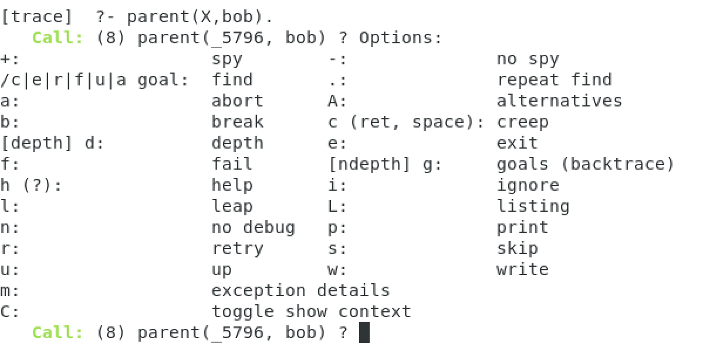

# CST8503 03 Prolog Debugging
_从 PDF 文档转换生成_

---
_注: 共提取了 5 张图片_

## 第 1 页


### Prolog Debugging
Procedural Interpretation and Debugging Prolog
### Programs

---

## 第 2 页

### Outcomes
### How Prolog Programs are executed: the Procedural Interpretation
### Tracing, Graphical Tracing, and Debugging Prolog Programs

---

## 第 3 页

Lesson Overview (Agenda)
In the following lesson, we will explore:
### Declarative Knowledge in Prolog Programs and procedural interpretation
### List notation preview
### Tracing Prolog's Search
### Graphical Tracing

---

## 第 4 页

### DECLARATIVE MEANING
In Context 1
, that is, writing a program in a file, OR at the user pseudofile
prompt |:
A clause ends with a period.
A clause in this context is a statement that is true because you are stating that it
is true.
When writing a Prolog program, you are defining a new world by stating what is
true.
You write down a set of clauses in a file, each ending with a period,

---

## 第 5 页

### DECLARATIVE MEANING
In Context 1, writing a program in a file OR at the user pseudofile prompt |:

```prolog
- thispred(arg).
- Means in English that (any or all of these)
- thispred is true of arg
- Example: dead(einstein).
- dead is true of einstein
- einstein is dead
- arg is thispred
- Example: blue(sky).
- sky is blue
- arg is a thispred
- Example: person(todd).
- todd is a person
```

---

## 第 6 页

### DECLARATIVE MEANING
In Context 1, writing a program in a file OR at the user pseudofile prompt |:

```prolog
- thispred(X).
- Note that in this case, the uppercase X is a variable.
- We would probably not want to say things like this
- English meaning
- for all X, thispred is true of X no matter what X is
- for all X, X is thispred no matter what X is
- for all X, X is a thispred no matter what X is
- X is called a singleton variable, because there are no other X's just one.
- We can always use the anonymous variable _ to replace a singleton, which
means this is equivalent thispred(_).
```

---

## 第 7 页

### DECLARATIVE MEANING
In Context 1, writing a program in a file OR at the user pseudofile prompt |:

```prolog
- thispred(arg1, arg2).
- Means in English that (any or all of these)
- thispred is true of arg1 and arg2
- Example: parent(bill, joan).
- bill is parent of joan
- Example: greaterthan(two,one).
- two greaterthan one
```

---

## 第 8 页

### DECLARATIVE MEANING
In Context 1, writing a program in a file OR at the user pseudofile prompt |:

```prolog
- thispred(arg1, X).
- Means in English that (any or all of these)
- For all X, thispred is true of arg1 and X no matter what X is
- Example: parent(bill, X).
- bill is parent of everbody
- bill is parent of X no matter what/who X is
- thispred(X, arg2).
- Means in English that (any or all of these)
- For all X, thispred is true of X and arg2 no matter what X is
- Example: parent(X, bill).
- everybody is parent of bill
- X is parent of bill no matter what X is
```

---

## 第 9 页

### DECLARATIVE MEANING
In Context 1, writing a program in a file OR at the user pseudofile prompt |:

```prolog
- thispred(X, Y).
- Means in English that (any or all of these)
- We would not want to say this.
- For all X, for all Y thispred is true of X and Y no matter what X and Y are
- Example: parent(X, Y).
- everybody is parent of everbody
- X is parent of Y no matter what/who X is and no matter what/who Y is
- Note that X and Y are both singleton variables in this case, so we could rewrite it as
below and it means the same thing:
- thispred(_, _).
```

---

## 第 10 页

### DECLARATIVE MEANING
In Context 1, writing a program in a file OR at the user pseudofile prompt |:

```prolog
- thispred(X, Y):-
this(X),
that(Y).
- Means in English that
if
- For all X, for all Y thispred is true of X and Y no matter what X and Y are
and
this(X) is true that(Y) is true.
- Note that neither X nor Y are singleton variables in this case, because they each
appear more than once in the clause. The two X's have to be the same thing, and
the two Y's have to be the same thing.
```

---

## 第 11 页

### DECLARATIVE MEANING
In Context 1, writing a program in a file OR at the user pseudofile prompt |:

```prolog
- thispred(X, Y):-
this(X,Y);
that(X,Y).
- Means in English that
if
- thispred is true of X and Y
or
this(X,Y) is true that(X,Y) is true.
or
- The character is optional. We could rewrite as two clauses without the or
thispred(X, Y):-
this(X,Y).
thispred(X, Y):-
that(X,Y).
```

---

## 第 12 页

### Prolog List Notation Preview
Examples of lists:
[ a, b, c, d]
[]
[ ann, tennis, tom, running]
[ link(a,b), link(a,c), link(b,d)]
[ a, [b,c], d, [ ], [a,a,a], f(X,Y) ]

---

## 第 13 页

Head and Tail
- L = [ a, b, c, d]
a is head of L
- [ b, c, d] is tail of L
- • More notation, vertical bar:
L = [ Head | Tail]
- L = [ a, b, c] = [ a | [ b, c]] = [ a, b | [ c]] = [ a, b, c | [ ] ]

---

## 第 14 页

### PROCEDURAL INTERPRETATION OF
### PROLOG PROGRAMS
The program we write in Prolog doesn't run until we
1.
Launch the Prolog interpreter
2.
Use consult to load our Prolog clauses into the
interpreter's
3.
issue a query at the ?- prompt, example ?- a,b,c.
4.
The interpreter applies the procedural interpretation

---

## 第 15 页

### PROCEDURAL INTERPRETATION
Example query are a and b and c true: ?- a,b,c.
1.
If no parts of query remain, return variable binding
2.
Take the next part of the query off the front for scanning
3.
Scan the facts and the left side of rules for a match
4.
If a fact matches, apply the variable binding from the match, goto 1.
5.
If the left side of a rule matches, apply the variable binding, add the right side
of the rule to the front of the query, goto 1.
6.
If nothing matches and there is a choice point, backtrack to 3
7.
Otherwise, fail

---

## 第 16 页

Tracing Prolog's Execution
When we debug a Prolog program, we watch the interpreter apply the procedural
interpretation
Debugging Prolog: https://www.swi-prolog.org/pldoc/man?section=debugoverview
The following special predicates are available for tracing Prolog's execution
trace/0 : for goals that follow, go step by step, displaying information
notrace/0 : stop further tracing
spy(P) : specifies that predicate P (example, parent) be traced
nospy(P) : stops tracing of predicate P

---

## 第 17 页


Examples of Tracing
Let's try tracing our family and ancestor predicates
?- trace.
Enter/return to creep
true.
one step at a time
Call: (8) parent(_5980, bob) ? creep
Exit: (8) parent(bill, bob) ? creep
Semicolon to find
X = bill ;
other solutions
Redo: (8) parent(_5980, bob) ? creep
Exit: (8) parent(joan, bob) ? creep
X = joan.
[trace] ?-

```prolog
[trace] ?- parent(X,bob).
```

---

## 第 18 页




Examples of Tracing
Question mark ? for help:

---

## 第 19 页

Tracing command examples
Command Name command meaning
creep c or space proceed to the next step in the trace
or
carriage
return
leap l continue execution, stop at next spy
point, if any
abort a abort prolog execution
no debug n continue execution in "no debug" mode
skip s skip tracing of calls to children of this
goal

| Command Name | command | meaning |
| --- | --- | --- |
| creep | c or space
or
carriage
return | proceed to the next step in the trace |
| leap | l | continue execution, stop at next spy
point, if any |
| abort | a | abort prolog execution |
| no debug | n | continue execution in "no debug" mode |
| skip | s | skip tracing of calls to children of this
goal |

---

## 第 20 页

Time to check your learning!
Let’s see how many key concepts from tracing you recall by answering the
following questions!
How does the user turn on goal tracing?
How does the user turn off goal tracing?
What command would abort the goal and return to the prolog prompt?

---

## 第 21 页

### Graphical Tracing
Resource: https://www.swi-prolog.org/gtrace.html
The graphical tracing facility helps the programmer view the tracing process by
showing source code, variable bindings, and the call stack
Graphical tracing is turned on with the built-in predicate, guitracer/0
Thereafter, tracing, when turned on, will be done in a graphical window.
We can turn on graphical mode and tracing mode at the same time: gtrace/0
We can turn off graphical mode with noguitracer/0

---

## 第 22 页

Time to check your learning!
Let’s see how many key concepts from topic graphical tracing you recall by
answering the following questions!
How can the programmer turn on graphical tracing?
What is the difference between guitracer(0) and gtrace(0)?

---

## 第 23 页

### Conclusion
In this lesson, you learned how to step through prolog's execution for the purposes
of debugging.
In the next lesson, you will learn to use prolog structures and matching.

---

