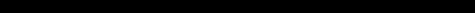

# CST8503 05 Prolog Lists Ops Arith
_从 PDF 文档转换生成_

---
_注: 共提取了 3 张图片_

## 第 1 页


Prolog Lists, Operators and
### Arithmetic

---

## 第 2 页

### Outcomes
### Prolog predicate argument types
### Directives
### Prolog Lists
### Prolog Operators
### Prolog Arithmetic

---

## 第 3 页

### Prolog
Prolog = “pure Prolog” + additions
Pure Prolog ~ logic
Additions make Prolog's logical basis to work in practice
### Additions:
“Pure” (do not affect logical meaning – just notational cosmetics)
List notation, operator notation
- “Dirty” (do not have a logical meaning, eg. write(X))
arithmetic, I/O

---

## 第 4 页

### Argument Mode Indicators
https://www.swi-prolog.org/pldoc/man?section=preddesc
- An argument mode indicator (in the documentation) gives information about the
intended direction in which information carried by a predicate argument is
supposed to flow.
Example: https://www.swi-prolog.org/pldoc/doc_for?object=member/2
member(?Elem, ?List):
True if Elem is a member of List.
- Think of the ?-argument as either providing input or accepting output or being used
for both input and output.

```prolog
?- member(X,[a,b,c]). % first arg is output, second arg is input
```

---

## 第 5 页

### Predicate Directives
https://www.swi-prolog.org/pldoc/man?section=declare
https://www.swi-prolog.org/pldoc/doc_for?object=(dynamic)/1
Informs the interpreter that the definition of the predicate(s) may change during
- execution (using assert/1 and/or retract/1).
https://www.swi-prolog.org/pldoc/doc_for?object=(multifile)/1
Informs the system that the specified predicate(s) may be defined over more
- than one file. This stops consult/1 from redefining a predicate when a new
definition is found.
https://www.swi-prolog.org/pldoc/doc_for?object=(discontiguous)/1
Informs the system that the clauses of the specified predicate(s) might not be
- together in the source file. See also style_check/1.

---

## 第 6 页

### List Notation
Examples of lists:
[ a, b, c, d]
[]
[ ann, tennis, tom, running]
[ link(a,b), link(a,c), link(b,d)]
[ a, [b,c], d, [ ], [a,a,a], f(X,Y) ]

---

## 第 7 页

Head and Tail
- L = [ a, b, c, d]
a is head of L
- [ b, c, d] is tail of L
- • More notation, vertical bar:
L = [ Head | Tail]
- L = [ a, b, c] = [ a | [ b, c]] = [ a, b | [ c]] = [ a, b, c | [ ] ]

---

## 第 8 页

List notation is Syntactic Sugar
List notation: [ Head | Tail]
Equivalent to standard Prolog notation: '[|]'( Head, Tail)
- Note: '[|]' is a functor (with –traditional option to prolog
- interpreter, this functor is ".")
Equivalent terms:
[ a, b, c] = '[|]'( a, '[|]'(b, '[|]'( c, [ ])))
- The latter expression can be, as usual, shown as a tree (first '[|]'
is root of tree)

---

## 第 9 页

### List Membership
% member( X, L) means that X is member of List L
TRY VARIOUS USES OF member/2

```prolog
member( X, [ X | _ ]). % X appears as head of list
member( X, [ _ | L]) :-
member( X, L). % X in tail of list
```

---

## 第 10 页

Concatenation of Lists
% conc( L1, L2, L3) means that L3 is concatenation of L1 and L2

```prolog
conc( [ ], L, L). % Base case
conc( [X | L1], L2, [X | L3]) :- % Recursive case
conc( L1, L2, L3).
```

---

## 第 11 页

Many uses of conc
L = [a,b,c,1,2,3]
L = [a, [b,c], d, a, [ ], b]

```prolog
?- conc( [a,b,c], [1,2,3], L).
?- conc( [a,[b,c],d], [a,[ ],b], L).
?- conc( L1, L2, [a,b,c] ).
....
```

---

## 第 12 页

### Generating Lists
Try this:

```prolog
?- conc( L, _, _).
....
```

---

## 第 13 页

Example of conc
Months before and after May?
?- Months = [jan,feb,mar,apr,may,jun,jul,aug,sep,oct,nov,dec] ,

```prolog
conc( Before, [may | After], Months).
…
```

---

## 第 14 页

Another example of conc
Delete everything that follows three consecutive occurrences of 'z'
?- L1 = [a,b,z,z,c,z,z,z,d,e], % Given list

```prolog
conc( L2, [z,z,z | _ ], L1). % L2 is L1 up to 3 z‟s
```

---

## 第 15 页

List membership with conc
% member2( X, L) means that X is member of list L
member2( X, L) :-

```prolog
conc( _, [X | _ ], L).
```

---

## 第 16 页

### List Deletion
% del( X, L, NewL) means that NewL is the List L with first X removed

```prolog
del( X, [X | Tail], Tail).
del( X, [Y | Tail], [Y | Tail1] ) :-
del( X, Tail, Tail1).
?- del( X, [ a, b, c, d], L1).
```

---

## 第 17 页

List insertion
% insert( X, L, NewL) means that NewL is List L with X inserted anywhere
% insert X into L “non-deterministically” at any position,
% resulting in NewL

```prolog
insert( X, L, [X | L]). % Insert X as head
insert( X, [Y | L], [Y | NewL]) :-
insert( X, L, NewL). % Insert X into tail
```

---

## 第 18 页

Insert as opposite of delete

```prolog
?- del( apple, L, [1,2,3] ). % What is L?
...
%
insert( X, L, LongerL) means that LongerL is List L with X inserted at any position
insert( X, List, LongerList) :-
del( X, LongerList, List).
% member3( X, L) means that X is an element of List L, alternative implementation
member3( X, L) :-
del( X, L, _). % X can be deleted from L
```

---

## 第 19 页




Sublist of a List
% sublist( List, Sublist) means that Sublist appears as a sublist in List
% It's easy!

```prolog
% Just draw List and Sublist and rewrite the drawing into Prolog
L
L1 S L3
sublist( S, L) :-
L2
conc( L1, L2, L),
conc( S, L3, L2).
```

---

## 第 20 页

Time to check your learning!
Let’s see how many key concepts from Prolog Lists you recall by answering the
following questions!
What is the difference between '[|]'(a,[]) and [a]?
What is the difference between [a] and [a|[ ]]?

---

## 第 21 页

### Operator Notation
Operator notation is just a cosmetic, surface notational improvement
Equivalent notations for arithmetic expressions:
+( *(2,a), *(b,c) ) = 2*a + b*c
+, * are infix operators built into Prolog
Higher precedence in Prolog means the outermost functor, so + has
higher precedence than *
Operators with lower Prolog precedence bind tighter as a result of this

---

## 第 22 页

User-defined operators
https://www.swi-prolog.org/pldoc/man?section=operators
This can be rewritten with infix operators as:

```prolog
has( peter, information).
supports( floor, table).
:- op( 600, xfx, has).
:- op( 600, xfx, supports).
peter has information.
floor supports table.
```

---

## 第 23 页

Operator types
(1) infix operators
xfx xfy yfx
(2) prefix operators
fx fy
(3) postfix operators
xf yf
yfx is left associative operator
xfy is right associative operator
‘y’should be interpreted as “on this position a term with precedence lower or equal to
the precedence of the functor should occur” . For‘x’ the precedence of the argument
must be strictly lower. (remember lower precedence in Prolog is more tightly binding)

---

## 第 24 页

Arithmetic operations
- Try to add 1 + 2 with:
?- X = 1+2.

```prolog
X = 1 + 2 % Prolog just keeps expression unevaluated
- This is better:
?- X is 1 + 2. % “is”: built-in predicate that forces calculation
X=3
- It is an error if the right side contains uninstantiated variables
-Number is +Expr
```

---

## 第 25 页

Arithmetic operations (cont'd)
+, -, *, /, ** addition, subtraction, …
//, mod operations on integers
sin, cos, log, ... standard functions
### X = 2.9999996829318345
?- A is 11/3.
### Y = 3.6666666666666665
?- B is 11//3.
C=3
?- C is 11 mod 3.
C=2

```prolog
?- X is 2 + sin(3.14/2).
```

---

## 第 26 页

### Comparison Predicates
X>Y
X<Y
### X >= Y
### X =< Y
X=:=Y X and Y are numerically equal
X=\=Y X and Y are not numerically equal
?- 315 * 3 >= 250*4.
yes
?- 2+5 = 5+2.
no
?- 2+5 =:= 5+2.
yes

---

## 第 27 页

List length
% length( L, N): N is the length of list L
N is N0 + 1.
In the second clause, can the order of goals be reversed?

```prolog
length( [ ], 0).
length( [ _ | L], N) :-
length( L, N0),
```

---

## 第 28 页

Time to check your learning!
Let’s see how many key concepts from Prolog Arithmetic you recall by answering
the following questions!
What is the difference between the two following prolog statements:
X is 3 + 4
### X = 3 + 4

---

