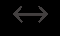

# CST8503 09 KR Logic
_从 PDF 文档转换生成_

---
_注: 共提取了 2 张图片_

## 第 1 页


### Knowledge Representation:
Logic

---

## 第 2 页

### Knowledge Representation Languages
Mathematical Logic Hierarchy
- Proposition Calculus (0th order)
No variables or quantifiers
- Propositions together with logical connectives
- • Predicate Calculus (1st order)
Adds Variables for terms, and quantification
- • Second Order Logics (2nd order)
Adds variables for predicates

---

## 第 3 页

### Propositional Calculus
- Propositions are true or false
The moon is made of cheese
- Socrates is a man
- Men are mortal
- The population of the world is 3 million
- • Questions are not propositions
What is the meaning of life, the universe, and
- everything?
Where is the door?

---

## 第 4 页



Propositional Calculus (cont'd)
Propositional Calculus or Propositional Logic is about
propositions and their combinations
Combine Propositions with logical connectives:
¬ not (negation)
- ∨ or (disjunction)
- ∧ and (conjunction)
- → implies (conditional)
- equivalence (bi-conditional)

---

## 第 5 页

Truth tables
How logical are humans?
Truth tables show the truth value of propositions and their
combinations
We can use symbols like p and q to represent propositions
### P Q P→ 𝑸
### T T T
### T F F
### F T T
### F F T

| P | Q | P→ 𝑸 |
| --- | --- | --- |
| T | T | T |
| T | F | F |
| F | T | T |
| F | F | T |

---

## 第 6 页

### Logical Equivalence
It turns out we don't need all of the connectives
Truth table proves P→ 𝑸 is logically equivalent to ¬𝑷 ∨ Q
There is no way to assign values to P or Q to make these two
formulas (formulae) different
### P Q P→ 𝑸 ¬𝑷 ∨ Q
### T T T T
### T F F F
### F T T T
### F F T T

| P | Q | P→ 𝑸 | ¬𝑷 ∨ Q |
| --- | --- | --- | --- |
| T | T | T | T |
| T | F | F | F |
| F | T | T | T |
| F | F | T | T |

---

## 第 7 页

When P is false
Many of us have some trouble with the last line of the previous
truth table:
### P Q P→ 𝑸
### F F T
Our intuition tells us that so much falsity in P and Q cannot result
in truth?
Explanation: P->Q is not as strong as our human intuition wants
to make it. It's saying that if P is true, then there is more to the
story. But if P is false, you can stop reading, the story is already
finished, in that we know the overall statement is true.

| P | Q | P→ 𝑸 |
| --- | --- | --- |
| F | F | T |

---

## 第 8 页

When P is false (cont'd)
Think of the following P->Q, F -> F statement, which is true:
If 2 < 1 then all humans are extremely wealthy
Our human intuition wants to say, no it's not true, because "making" 2 < 1 true would
not cause humans to be wealthy, the concepts are unrelated
After we get used to it, we can see that 2<1 is simply false, and it doesn't make sense
to imagine "making" it true. The "making" it true is not part of the statement (it's a
weak statement).
Our intuition wants to draw a causal relationship between "making" P true, and
causing Q (all humans to be wealthy).
Our intuition wants to say "no such relationship exists" so "false"
Logic says if P is false, then the statement is true and it doesn't matter what Q is

---

## 第 9 页

Why do we care about logic?
- Propositional Calculus is a tool that allows us to derive
conclusions from combinations of simpler statements known
to be true
- We are seeing the workings of a system where we can
Make statements that we know to be true
- The logical entailments of those statements are also
- true
Prolog systematically finds logical entailments

---

## 第 10 页

Time to check your learning!
Let’s see how many key concepts from propositional calculus you recall by filling in
the truth table:
### P Q P→ 𝑸 ¬𝑷 ∨ Q
T T
T F
F T
F F

| P | Q | P→ 𝑸 | ¬𝑷 ∨ Q |
| --- | --- | --- | --- |
| T | T |  |  |
| T | F |  |  |
| F | T |  |  |
| F | F |  |  |

---

## 第 11 页

### Predicate Calculus
Predicate Calculus (or first-order predicate calculus FOPC or first-order logic FOL)
gives us all of propositional calculus, plus the following logical symbols
- Variables to represent terms, or "things in the domain"
- Quantifiers
∀ universal quantification, forall
- ∃ existential quantification, exists
- • = equality symbol

---

## 第 12 页

First Order Logic equivalents to Prolog statements
Prolog FOL

```prolog
ancestor(X,Y) :- parent(X,Y). ∀𝑋 ∀𝑌𝑝𝑎𝑟𝑒𝑛𝑡(𝑋, 𝑌) → 𝑎𝑛𝑐𝑒𝑠𝑡𝑜𝑟(𝑋, 𝑌)
ancestor(X,Z) :- ∀𝑋∀𝑌∀𝑍 𝑝𝑎𝑟𝑒𝑛𝑡 𝑋, 𝑌 ∧ 𝑎𝑛𝑐𝑒𝑠𝑡𝑜𝑟 𝑌, 𝑍
parent(X,Y), → 𝑎𝑛𝑐𝑒𝑠𝑡𝑜𝑟(𝑋, 𝑍)
ancestor(Y,Z).
parent(john,sue). 𝑝𝑎𝑟𝑒𝑛𝑡(𝑗𝑜ℎ𝑛, 𝑠𝑢𝑒)
parent(X,sue):- ∀𝑋 𝑋 = 𝑗𝑜ℎ𝑛 ∨ 𝑋 = 𝑠𝑎𝑙𝑙𝑦 → 𝑝𝑎𝑟𝑒𝑛𝑡(𝑋, 𝑠𝑢𝑒)
X = john
;
X = sally.
```

| Prolog | FOL |
| --- | --- |
| ancestor(X,Y) :- parent(X,Y). | ∀𝑋 ∀𝑌𝑝𝑎𝑟𝑒𝑛𝑡(𝑋, 𝑌) → 𝑎𝑛𝑐𝑒𝑠𝑡𝑜𝑟(𝑋, 𝑌) |
| ancestor(X,Z) :-
parent(X,Y),
ancestor(Y,Z). | ∀𝑋∀𝑌∀𝑍 𝑝𝑎𝑟𝑒𝑛𝑡 𝑋, 𝑌 ∧ 𝑎𝑛𝑐𝑒𝑠𝑡𝑜𝑟 𝑌, 𝑍
→ 𝑎𝑛𝑐𝑒𝑠𝑡𝑜𝑟(𝑋, 𝑍) |
| parent(john,sue). | 𝑝𝑎𝑟𝑒𝑛𝑡(𝑗𝑜ℎ𝑛, 𝑠𝑢𝑒) |
| parent(X,sue):-
X = john
;
X = sally. | ∀𝑋 𝑋 = 𝑗𝑜ℎ𝑛 ∨ 𝑋 = 𝑠𝑎𝑙𝑙𝑦 → 𝑝𝑎𝑟𝑒𝑛𝑡(𝑋, 𝑠𝑢𝑒) |

---

## 第 13 页

Predicate Calculus (cont'd)
As well as the additional logical symbols, predicate calculus
adds non-logical symbols:
function symbols of different arity
for example: +, -, 0, 1, 2, todd, triangle
predicate symbols of different arity
for example: <, rides_a_bike, triangle_exists,

---

## 第 14 页

First-order terms represent
things
With the additional symbols, we can build terms that represent
things in our domain of discourse:
Variables: Any variable is a term.
Functions: Any expression f(t ,...,t ) of n arguments, where
1 n
each argument t is a term and f is a function symbol of arity n, is
i
a term.
Constants: A special case of a function term where the arity
is 0

---

## 第 15 页

Term examples
+(3,4) : a term that denotes a number
3 is a constant, which strictly speaking is a function
- that takes no arguments
4 is another function of no arguments
- + is a function of arity 2
- • temperature_of(mars) : a term that denotes a temperature
mars is a constant
- temperature_of is a function of arity 1

---

## 第 16 页

FOL Formulas represent
statements about things
We saw that terms represent things.
Formulas, or well-formed formulas (formulae), or wwfs, are built
up from predicates (and equality) that take terms as arguments,
and make true or false statements about things
for example:
=(+(1,1),2)
- <(temperature_of(mars),3)
- rides_a_bike(todd)

---

## 第 17 页

Prolog terminology vs Predicate Calculus terminology
Unfortunately, the terminology differs between the Predicate Calculus and Prolog:
- term in FOL
is a function applied to zero or more arguments
- represents a thing,
- for example +(3,4) with two arguments represents a number, seven
- 4 with zero arguments represents a number, four
- mother_of(bob) with one argument represents a person, bob's mother
- • Atomic Well-formed formula (WWF), also called "atom", in FOL
is a predicate applied to zero or more arguments which are terms
- represents a true-or-false statement about zero or more terms (things)

---

## 第 18 页

Prolog terminology vs Predicate Calculus terminology
(cont'd)
- Non-atomic WWF in FOL
Is also a statement
- Involves logical connectives like ¬,∧,∨ (not, and, or)

---

## 第 19 页

Prolog terminology vs Predicate Calculus terminology
- term in Prolog is any structure:
Functions applied to arguments
- +(3,4)
- mother_of(bob)
- Predicates applied to arguments
- >(4,3)
- parent(bill,bob)
- Everything is a term, even something such as a:-b,c
- :-(a,','(b,c))
- •atom in Prolog is a function of no arguments, such as a, todd, etc
- numbers in prolog are also functions of no arguments, such as 3, 66, etc

---

## 第 20 页

FOL Formulas (cont'd)
We can also use the logical connectives and other logical symbols in formulas
These are examples of statements which may be true or false:
Example1: For all x, there exists a y such that y is greater than x:
∀𝑥∃𝑦 > (𝑦, 𝑥)
Example2: It's not the case that there exists an x such that forall y, y is greater
than x:
¬ (∃𝑥∀𝑦 > (𝑦, 𝑥))

---

## 第 21 页

Formulas (cont'd)
Let's look closer at the ordering of the quantifiers in statements
like these.
True statement: It's not the case that there exists an x such that
every y is greater than x:
¬ ∃𝑥∀𝑦 > 𝑦, 𝑥
This one below looks similar but says something completely
different:
¬ (∀𝑥∃𝑦 > (𝑦, 𝑥))
False statement: it's not the case that forall x, there exists a y
such that y is greater than x

---

## 第 22 页

More reader friendly with infix
notation of greater-than?
Often we find infix notation for > is easier to read than prefix.
True statement: It's not the case that there exists an x such that
every y is greater than x:
¬ ∃𝑥∀𝑦 𝑦 > 𝑥
This looks similar but says something completely different:
¬ (∀𝑥∃𝑦 (𝑦 > 𝑥))
False statement: it's not the case that forall x, there exists a y
such that y is greater than x

---

## 第 23 页

Now, without the negation
Let's look at the two statements on the previous slide, but
change them by removing the negation symbol:
Example1: False statement: there exists an x such that every y
is greater than x:
∃𝑥∀𝑦 (𝑦 > 𝑥)
Example2: This looks similar but says something completely
different:
∀𝑥∃𝑦 (𝑦 > 𝑥)
True statement: forall x, there exists a y such that y is greater
than x (think of y = x + 1 where no matter what x is, y is greater)

---

## 第 24 页

More intuitive example?
Ordering of the quantifiers is important.
Consider mother_of(x,y) to mean "x is the mother of y"
In infix notation: x mother_of y
Everyone has a mother, and it's the same mother:
∃𝑥∀𝑦 (𝑥 𝑚𝑜𝑡ℎ𝑒𝑟_𝑜𝑓 𝑦)
Now, same variables, different order of quantifiers:
Everyone has a possibly different mother
∀𝑦∃𝑥 (𝑥 𝑚𝑜𝑡ℎ𝑒𝑟_𝑜𝑓 𝑦)

---

## 第 25 页

Order of universal quantifiers?
In the previous slides, the ordering of exists and forall does
affect meaning.
The ordering of universal quantifiers (forall) does not matter
∀𝑥∀𝑦 (𝑥 𝑓𝑒𝑙𝑙𝑜𝑤_ℎ𝑢𝑚𝑎𝑛_𝑜𝑓 𝑦)
Everybody is fellow_human_of everybody
∀𝑦∀𝑥 (𝑥 𝑓𝑒𝑙𝑙𝑜𝑤_ℎ𝑢𝑚𝑎𝑛_𝑜𝑓 𝑦)
These two statements mean the same thing (logically
equivalent)

---

## 第 26 页

Free variables
A variable that is not bound to any quantifier in a formula is
called a free variable
We don't want to write logical sentences with free variables
because those variable values depend on the interpretation
We are trying to say things that are true regardless of
interpretation, and free variables prevent that
So, when we see free variables in Sitcalc or Prolog, they aren't
actually free, they are implicitly prenex universally quantified

---

## 第 27 页

Prenex universal quantification
A formula is in prenex normal form when all the quantifiers are
together on the left side of the formula, in what's called the
prefix.
A related idea is prenex universal quantification, which is
when a variable is universally quantified and the quantifier is in
the prefix.
If there are no free variables in a formula, and all quantifiers in
the prefix are universal, then we can drop the prefix if we
assume all resulting free variables are prenex universally
quantified

---

## 第 28 页

FOL Axioms
- We can “create” a new world by making statements that are true in that world,
very much like an author writing a novel makes statements about what is true in
that novel world.
- Unlike a novelist, we make our statements using first-order logic sentences
instead of (for example) English sentences.
- The statements we make in first-order logic, to specify a world, are called axioms
- Axioms are taken to be true without proof because they are stated, similarly to
how a novelist makes statements about the characters of a novel
- Axioms must be consistent, because a contradiction can be used to prove
anything by contradiction (inconsistent axioms are useless to us).

---

## 第 29 页

Time to check your learning!
Let’s see how many key concepts from first-order predicate calculus you recall by
answering the following questions!
Which of the following are FOL terms or not FOL terms:
- → 𝑥
- 𝑥
- 𝑥 > 𝑦
- todd
- temperature_of(todd)
- loves(cathy,joseph)

---

## 第 30 页

Higher-order logic
Second-order (and higher-order) logic involves quantifying over not just variables
(terms), but also predicates
These systems are more expressive, but things get complicated
Their model-theoretic properties are less well-behaved than those of first-order
logic
In this course, we will limit our scope to First Order Logic (FOL) in order to benefit
from the nice model-theoretic properties of FOL
First Order Logic can be converted to clausal form
All Prolog programs are sets of Horn clauses, a specific clausal form

---

## 第 31 页

Time to check your learning!
Let’s see how many key concepts from Higher Order Logic you recall by answering
the following questions!
If Higher-Order logics are more expressive, why do we limit ourselves to First-
Order logic in this course?

---

