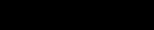

# CST8503 11 KR Logic To Prolog
_从 PDF 文档转换生成_

---
_注: 共提取了 4 张图片_

## 第 1 页


### Knowledge Representation:
Logic To CNF To Prolog

---

## 第 2 页

### Clausal Normal Form
Any FOL (Situation Calculus) formulae can be converted to
clausal form:
### Eliminate implications
### Move negation inwards
### Standardize variables apart
### Skolemize existentials
### Move universal quantifiers outwards
### Distribute "and" ∧ over "or" ∨

---

## 第 3 页

CNF Step 1: remove implication
### 𝑃 → 𝑄
becomes the logically equivalent
### ¬𝑃 ∨ 𝑄
Example
∀𝑥 𝑚𝑎𝑛 𝑥 → ℎ𝑢𝑚𝑎𝑛 𝑥
### Becomes
∀𝑥 ¬𝑚𝑎𝑛 𝑥 ∨ ℎ𝑢𝑚𝑎𝑛 𝑥

---

## 第 4 页

CNF Step 2: move negation inwards
Replace this With this
### ¬(𝑃 ∧ 𝑄) ¬𝑃 ∨ ¬𝑄
### ¬(𝑃 ∨ 𝑄) ¬𝑃 ∧ ¬𝑄
¬∀𝑥 𝑃 ∃𝑥 ¬𝑃
¬∃𝑥 𝑃 ∀𝑥 ¬𝑃
### ¬¬ 𝑃 𝑃

| Replace this | With this |
| --- | --- |
| ¬(𝑃 ∧ 𝑄) | ¬𝑃 ∨ ¬𝑄 |
| ¬(𝑃 ∨ 𝑄) | ¬𝑃 ∧ ¬𝑄 |
| ¬∀𝑥 𝑃 | ∃𝑥 ¬𝑃 |
| ¬∃𝑥 𝑃 | ∀𝑥 ¬𝑃 |
| ¬¬ 𝑃 | 𝑃 |

---

## 第 5 页

CNF Step 3: Standardize Variables Apart
Rename variables such that each quantifier uses a different variable name:
### Example:
∀𝑥 𝑃 𝑥 ∨ ∃𝑥𝑄 𝑥
### Becomes
∀𝑥 𝑃 𝑥 ∨ ∃𝑦𝑄 𝑦
This is analogous to Java code (change red x to z):
{ int x = 4; int y = 9;
{ int x = 2;
x = y + x
}
}

---

## 第 6 页

CNF Step 4: Skolemize
Replace existentially quantified variables with skolem functions
Each universally quantified variable whose scope includes the
existential becomes a parameter of the skolem function
The idea is that if we know something exists, we can give it a
name (any name that works for us is fine)
∀𝑥∃𝑦𝑃 𝑥, 𝑦 becomes ∀𝑥𝑃 𝑥, 𝑎(𝑥) where a depends on x
∃𝑦∀𝑥𝑃 𝑥, 𝑦 becomes ∀𝑥𝑃 𝑥, 𝑎 a doesn't depend on x
### Examples:
∀𝑥∃𝑦 𝑚𝑜𝑡ℎ𝑒𝑟 𝑥, 𝑦 becomes ∀𝑥 𝑚𝑜𝑡ℎ𝑒𝑟 𝑥, 𝑚𝑜𝑚(𝑥)
∃𝑥 𝑚𝑜𝑜𝑛 𝑥 becomes moon(the_moon)

---

## 第 7 页

CNF Step 5: move universal quantifiers
outwards
After skolemizing, we have only universal quantifiers
Because we've standardized variables apart, we can move them
all to the outer left
In fact, we can now assume all variables are universally
quantified, and just drop the universal quantifiers

---

## 第 8 页

CNF Step 6: Distribute "and" ∧ over "or" ∨
Replace this With this
### (𝑃 ∧ 𝑄) ∨ 𝑅 (𝑃 ∨ 𝑅) ∧ (𝑄 ∨ 𝑅)
### 𝑃 ∨ (𝑄 ∧ 𝑅) (𝑃 ∨ 𝑄) ∧ (𝑃 ∨ 𝑅)

| Replace this | With this |
| --- | --- |
| (𝑃 ∧ 𝑄) ∨ 𝑅 | (𝑃 ∨ 𝑅) ∧ (𝑄 ∨ 𝑅) |
| 𝑃 ∨ (𝑄 ∧ 𝑅) | (𝑃 ∨ 𝑄) ∧ (𝑃 ∨ 𝑅) |

---

## 第 9 页

Write down the CNF
Now we have a formula of the form
### 𝑃 ∧ 𝑃 ∧ 𝑃 ∧ 𝑃 ∧ 𝑃 ∧ 𝑃 ∧ ⋯
1 2 3 4 5 6
where each 𝑃 might include one or more disjunctions
𝑖
We write this as a set of clauses:
{𝑃 , 𝑃 , 𝑃 , 𝑃 , 𝑃 , 𝑃 , … } These P in general each have this
1 2 3 4 5 6 i
form
### 𝐿 ∨ 𝐿 ∨ ⋯ ∨ ¬𝑁 ∨ ¬𝑁 ∨ ⋯
1 2 1 2

| Now we have a formula of the form
𝑃 ∧ 𝑃 ∧ 𝑃 ∧ 𝑃 ∧ 𝑃 ∧ 𝑃 ∧ ⋯
1 2 3 4 5 6
where each 𝑃 might include one or more disjunctions
𝑖
We write this as a set of clauses:
{𝑃 , 𝑃 , 𝑃 , 𝑃 , 𝑃 , 𝑃 , … } These P in gene
1 2 3 4 5 6 i
form
𝐿 ∨ 𝐿 ∨ ⋯
1 2 |  |  |
| --- | --- | --- |
|  | These P in gene
i
form
𝐿 ∨ 𝐿 ∨ ⋯
1 2 | ral each have this
∨ ¬𝑁 ∨ ¬𝑁 ∨ ⋯
1 2 |

---

## 第 10 页




A Prolog program is a set of
Horn clauses
A Horn clause is any clause that has at most one positive literal (0 or 1 positive
literals). The positive literals are the L
i
When we write a Prolog program, we are writing down a set of Horn clauses with
0 or 1 L :
When restricted to be Horn clauses, these P in a
i
### {𝑃 , 𝑃 , 𝑃 , 𝑃 , 𝑃 , 𝑃 , … }
Prolog program each have this form
1 2 3 4 5 6
### L ∨ ¬𝑁 ∨ ¬𝑁 ∨ ⋯
1 2
or
One positive, several Negative
L
One positive, zero Negative
or
Zero positive, several Negative
### ¬𝑁 ∨ ¬𝑁 ∨ ⋯
1 2

---

## 第 11 页

Converting CNF to Prolog
Each of the clauses 𝑃 has this general form:
𝑛
### 𝐿 ∨ 𝐿 ∨ ⋯ ∨ ¬𝑁 ∨ ¬𝑁 ∨ ⋯
1 2 1 2
Where we have gathered all of the negative literals on the right
side (since the order doesn't matter)
We can put parenthesis in without changing meaning:
### (𝐿 ∨ 𝐿 ∨ ⋯ ) ∨ (¬𝑁 ∨ ¬𝑁 ∨ ⋯ )
1 2 1 2
Now put in an implication (note reverse direction):
### (𝐿 ∨ 𝐿 ∨ ⋯ ) ← (𝑁 ∧ 𝑁 ∧ ⋯ )
1 2 1 2
Prolog is limited to clauses with 0 or 1 L on the left side
i

---

## 第 12 页

### Horn Clauses
A horn clause with one L would look like this
### (𝐿 ) ← (𝑁 ∧ 𝑁 ∧ ⋯ )
1 1 2
In our familiar prolog syntax this would would be a rule:
### L :- N1,N2,…
A horn clause with just one positive literal is a fact;
L.
A horn clause with no L is a query!
### ?- N1,N2…

---

## 第 13 页

Prolog is limited to Horn Clauses
A clause of this form, not allowed in Prolog:
### (𝐿 ∨ 𝐿 ) ← (𝑁 ∧ 𝑁 )
1 2 1 2
would be read "If N1 is true and N2 is true, then L1 is true or L2 is
true."
A clause of this form, not allowed in Prolog:
### (𝐿 ∨ 𝐿 )
1 2
would be read "L1 is true or L2 is true."
So in a Prolog program we cannot say "the sky is blue or the sea is
green":

```prolog
color(sky,blue);color(sea,green).
```

---

## 第 14 页

Example: Sitcalc to Prolog
Recall we have two types of axiom:
### Action precondition Axioms (what can happen)
𝑃𝑜𝑠𝑠(𝐴(𝑥Ԧ), 𝑠) ≡ Φ(𝑥Ԧ, 𝑠)
### Successor State Axioms (if it happens, then what's true
afterwards?)
𝑃𝑜𝑠𝑠(𝐴(𝑥Ԧ), 𝑠) ⊃ 𝑅(𝑦Ԧ, 𝑑𝑜(𝐴 𝑥Ԧ, 𝑠 ) ≡
+
𝛾 𝑦Ԧ, 𝐴 𝑥Ԧ , 𝑠 ∨
𝑅
−
𝑅 𝑦Ԧ, 𝑠 ∧ ¬𝛾 𝑦Ԧ, 𝐴 𝑥Ԧ , 𝑠
𝑅

---

## 第 15 页

### Precondition Axioms
Long story short, when translating equivalence ≡, because of Clark's
Completion Semantics, CWA, Negation as Failure, we can simply make
the implication go one way only:
𝑃𝑜𝑠𝑠(𝐴(𝑥Ԧ), 𝑠) ← Φ(𝑥Ԧ, 𝑠)
In actual prolog, we might have this:
No 𝑥Ԧ in this case, and Φ 𝑠 is 𝑛𝑒𝑎𝑟_𝑑𝑜𝑜𝑟(𝑠) ∧ 𝑑𝑜𝑜𝑟_𝑐𝑙𝑜𝑠𝑒𝑑(𝑠)

```prolog
poss(open_door,S) :-
near_door(S),
door_closed(S).
```

---

## 第 16 页

### Successor State Axioms
𝑃𝑜𝑠𝑠(𝐴(𝑥Ԧ), 𝑠) ⊃ 𝑅(𝑦Ԧ, 𝑑𝑜(𝐴 𝑥Ԧ, 𝑠 ) ≡
+
𝛾 𝑦Ԧ, 𝐴 𝑥Ԧ , 𝑠 ∨
𝑅
−
𝑅 𝑦Ԧ, 𝑠 ∧ ¬𝛾 𝑦Ԧ, 𝐴 𝑥Ԧ , 𝑠
𝑅
### Becomes
𝑅(𝑦Ԧ, 𝑑𝑜(𝐴 𝑥Ԧ, 𝑠 ) ← 𝑃𝑜𝑠𝑠(𝐴(𝑥Ԧ), 𝑠) ∧
+
(𝛾 𝑦Ԧ, 𝐴 𝑥Ԧ , 𝑠 ∨
𝑅
−
𝑅 𝑦Ԧ, 𝑠 ∧ ¬𝛾 𝑦Ԧ, 𝐴 𝑥Ԧ , 𝑠 )
𝑅

---

## 第 17 页

Not so fast?
Let's replace the three parts of that first big formula on the
previous slide with A, B, C:
### A -> B <-> C
(-A or B) <-> C
(-A or B) <- C (make implication go one way)
-C or –A or B
### A,C->B
### B<-A,C
When you look carefully, this is the second formula

---

## 第 18 页

(reminder) Steps to Axiomatize a Domain
In the following steps, the word "determine" implies "write down"
### Understand the domain by reading about it, studying it, and thinking about it
### Determine the set of fluents that are sufficient to represent a state in the domain
### Determine the set of actions that effect (bring about) change in the state (fluent
truth values)
### Determine the precondition axioms for actions in terms of fluents
### Determine the successor state axiom for each fluent
### Determine the fluent values in the initial situation s0 (we use [] for s0).

---

