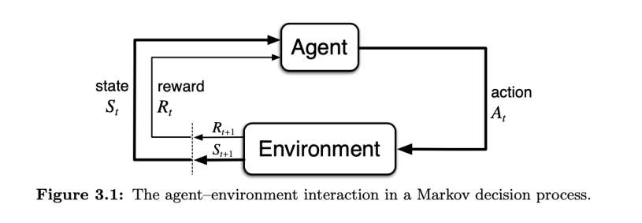

# CST8503 13 Final Review

_从 PDF 文档转换生成_

---

_注: 共提取了 4 张图片_

## 第 1 页


**Final Review**

---

## 第 2 页

### Final Exam

**CST8503 Final Exam Tuesday Dec 9th 9:30-11:30am A1120**

- 1hr test in 2 hours
- Closed book, no Internet
- Part multiple choice Scantron Quiz (bring pencils, erasers)
- Part written answers on paper (bring pencils/pens erasers)
- Covers material so far in course

**Study guide:**

- Review lectures slides/notes
- Review hybrid activity quizzes
- Review labs and assignment

---

## 第 3 页

### Topics

**First Half of Course:**

- Knowledge Representation
- Declarative Programming
- Prolog Language
  - CWA, Variables, Procedural Interpretation, Matching vs Unification
- Prolog Syntax
  - Structures, Lists
- Recursion and examples
- Cut
- Negation as failure

---

## 第 4 页

### Topics

**Second Half of Course:**

- Logic and Knowledge Representation Languages
- Situation Calculus
- Translating Mathematical Logic formulae into Horn Clauses for Prolog
- Prolog: writing practical Knowledge Representation programs (Blocks World)
- Planning
- Breadth-first vs Depth-first planning
- Old-school Chatbot operation

---

## 第 5 页

### Possible Questions

**Multiple Choice:**

- Similar to hybrid quizzes and Midterm questions
- Could be based on the "Check your learning" slide questions

**Written Answer:**

- Write small programs involving recursion, possibly from lab or assignment
- Axiomatize a simple domain (Blocks world or simpler)
- Could be based on the "Check your learning" slide questions

---

## 第 6 页

### Beyond this course

Taking this course was a first step – where do you go from here?

**What's next?**

The situation calculus can represent domains with:

- time
- continuous processes
- concurrent actions
- natural actions
- nondeterministic actions

---

## 第 7 页

### The Book

Ray Reiter wrote "the book" on this subject

https://www.amazon.ca/Knowledge-Action-Foundations-Specifying-Implementing/dp/0262182181

**Example Paper:**

https://www.cs.toronto.edu/~cebly/Papers/frame.pdf

---

## 第 8 页

### Beyond this course

**Constraint Logic Programming** incorporates regular Prolog programming, but can also handle constraints, like "the sum of X and Y is greater than zero" with `#>/2`:

```prolog
A(X,Y) :- X+Y #> 0, B(X), C(Y).
```

https://www.swi-prolog.org/pldoc/man?section=clp

---

## 第 9 页

### Beyond this course (cont'd)

Breadth-first planning takes a long time for long action sequences; however, Prolog, like all declarative languages (functional is also declarative) are conducive to parallelism.

---

## 第 10 页

### Beyond this course (cont'd)

**Retrieval Augmented Generation:** An AI system uses a Prolog interpreter to generate or verify plans.

Verifying a plan is much faster/easier than generating a plan.

A combination of ML and KR/Prolog for planning:

- ML-based systems will "guess" at plans, and
- KR/Prolog systems can then quickly verify whether the guess is indeed a plan, with full explanability.

---

## 第 11 页

### Beyond this course (cont'd)

**Token Generation:**

- An AI system is trained on tokens generated by a KR system with Prolog.
- The AI system generalizes the logical reasoning in the output of the KR system

**What might the token stream be (initial proposal)?**

- The axiomatization of the domain
- Enumerate situations, starting with `[]`
- Truth value of each fluent in that situation, with proof
- Each proof consists of rule, and (recursively) proof of each term on the right side of rule.

---

## 第 12 页

### Beyond this course (cont'd)

- Use any version of Prolog you want
- Use cut if you want/need to!
- Use non-logical elements if it suits your purposes
- Use any programming style that suits your preferences and makes sense for your problem at hand
- Use any Knowledge Representation formalism that suits your preferences and makes sense for your problem at hand (Event Calculus is an alternative to the Situation Calculus, for example)

---

## 第 13 页

### Reinforcement Learning Environments

- Reinforcement Learning vs GPT (LLMs) discussed on the podcasts
- Situation calculus axiomatizations of domains can implement Reinforcement Learning Environments
- An RL Agent trained using that environment learns to make decisions about actions in that domain

---

## 第 14 页




### Anatomy of a Reinforcement Learning Problem

- Agent and environment diagram: Agent learns about environment
- Sitcalc Axiomatization: our algorithm operates in the agent

---

## 第 15 页

### Possible directions

- AI system takes a description of a domain
- AI system produces AI-generated axiomatization of domain

**What are the fluents**

**What are the actions**

**When are the actions possible (Precondition Axioms)**

**What is the initial state (Initial State Axioms)**

**What are the successor states (Successor State Axioms)**

---

## 第 16 页

### Possible directions

Same as previous slide, except:

- AI system learns about a domain (RL)
- AI system produces AI-generated axiomatization of domain

**What are the fluents**

**What are the actions**

**When are the actions possible (Precondition Axioms)**

**What is the initial state (Initial State Axioms)**

**What are the successor states (Successor State Axioms)**

---
