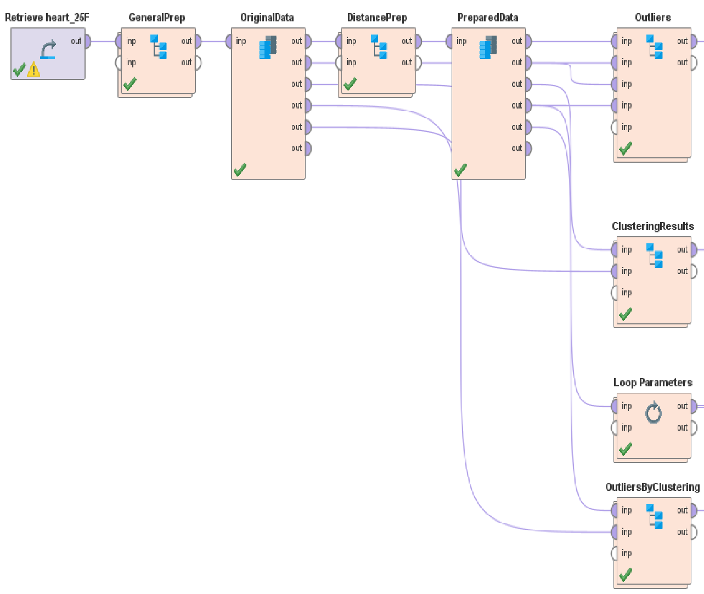

# Assignment 2 - RapidMiner AI Studio 2025.1.1 Workflow

_Adapted from the assignment brief to a practical, executable RapidMiner process. Tested against Altair AI Studio 2025.1.1 interface._
_Reference: [Altair AI Studio Documentation 2025.1.1](https://docs.rapidminer.com/2025.1/studio/index.html)_

---

## 1. Top-Level Process Layout

Structure the main process canvas to match grading expectations:

_Official assignment visual for required subprocess layout._

### Layout Order / Renaming Guide

| Operator search term | Original operator           | Required label            |
| -------------------- | --------------------------- | ------------------------- |
| Retrieve             | Retrieve (repository entry) | Peng_RetrieveHeart25F     |
| Subprocess           | GeneralPrep                 | Peng_GeneralPrep          |
| Subprocess           | DistancePrep                | Peng_DistancePrep         |
| Subprocess           | Outliers                    | Peng_Outliers             |
| Subprocess           | ClusteringResults           | Peng_ClusteringResults    |
| Loop Parameters      | LoopParameters              | Peng_LoopParameters       |
| Subprocess           | OutliersByClustering        | Peng_OutliersByClustering |
| Subprocess           | CommonOutliers              | Peng_CommonOutliers       |

### Dataset Field Reference

| Attribute        | Type        | Description                                                                                 |
| ---------------- | ----------- | ------------------------------------------------------------------------------------------- |
| `Age`            | Numeric     | Patient age in years.                                                                       |
| `Sex`            | Nominal     | Biological sex (`M`, `F`).                                                                  |
| `ChestPainType`  | Nominal     | Chest pain category (`TA`, `ATA`, `NAP`, `ASY`).                                            |
| `RestingBP`      | Numeric     | Resting blood pressure in mm Hg.                                                            |
| `Cholesterol`    | Numeric     | Serum cholesterol in mg/dl.                                                                 |
| `FastingBS`      | Numeric     | Fasting blood sugar flag (`1` if >120 mg/dl, else `0`).                                     |
| `RestingECG`     | Nominal     | Resting electrocardiogram results.                                                          |
| `ExerciseAngina` | Nominal     | Exercise-induced angina (`Y`, `N`).                                                         |
| `Oldpeak`        | Numeric     | ST depression induced by exercise relative to rest.                                         |
| `ST_Slope`       | Nominal     | Slope of the peak exercise ST segment.                                                      |
| `HeartDisease`   | Label (bin) | Target outcome (`1` indicates presence of heart disease, `0` indicates absence of disease). |

---

## 2. `GeneralPrep` Subprocess

### Configuration Steps

| Step | Operator search term | Rename                | Settings                                                                                   |
| ---- | -------------------- | --------------------- | ------------------------------------------------------------------------------------------ |
| 1    | Select Attributes    | Peng_SelectNoID       | Set `attribute filter type = regular attributes`. Remove existing `id`.               |
| 2    | Remove Duplicates    | Peng_RemoveDuplicates | Use default parameters.                                                                    |
| 3    | Generate ID          | Peng_GenerateID       | Set `add id attribute = true`. Keep generated name `id`.                              |
| 4    | Set Role             | Peng_SetRole          | Set `HeartDisease → label`. Set `id → id`. Set remaining attributes → `regular`. |

> _Screenshot Reminder_: capture the `GeneralPrep` subprocess layout once complete.

---

## 3. `DistancePrep` Subprocess

### Configuration Steps

| Step | Operator search term | Rename                  | Settings                                                                                                                                                                                                                             |
| ---- | -------------------- | ----------------------- | ------------------------------------------------------------------------------------------------------------------------------------------------------------------------------------------------------------------------------------ |
| 1    | Nominal to Numerical | Peng_NominalToNumerical | Set `attribute filter type = all`. Set `coding type = dummy coding`. Keep unexpected value handling default.                                                                                                               |
| 2    | Normalize            | Peng_Normalize          | Set `attribute filter type = subset` and select `Age`, `RestingBP`, `Cholesterol`, `MaxHR`, `Oldpeak` (and any other true continuous fields you keep). Set `method = Z-transformation`. Leave optional checkboxes cleared. |

> _Screenshot Reminder_: capture `DistancePrep` and list encoded/normalized attributes in the answer sheet.

> _Why subset?_: Dummy variables generated from the nominal fields already carry 0/1 semantics. Leaving them out of normalization keeps their indicator meaning intact while still standardizing the continuous metrics used for distance calculations.

---

## 4. `Outliers` Subprocess

### Configuration Steps

| Step | Operator search term       | Rename                | Settings                                                                                                                                                                                                                                         |
| ---- | -------------------------- | --------------------- | ------------------------------------------------------------------------------------------------------------------------------------------------------------------------------------------------------------------------------------------------ |
| 1    | Local Outlier Factor (LOF) | Peng_LOF              | Set `k min (MinPtsLB) = 10`. Set `k max (MinPtsUB) = 20`. Set `distance function = MixedEuclideanDistance`.                                                                                                                            |
| 2    | Generate Outlier Flag      | Peng_LOF_Flag         | Set `method = contamination`. Set `contamination threshold = 0.05`. Enable `define score column`. Keep score column name `outlier`.                                                                                               |
| 3    | Rename                     | Peng_RenameLOF        | Set `outlier → LOF_Outlier`.                                                                                                                                                                                                                     |
| 4    | Filter Examples            | Peng_FilterLOFTrue    | Set `filters = LOF_Outlier = Outlier`.                                                                                                                                                                                                           |
| 5    | Detect Outliers (Distance) | Peng_DistanceOutliers | Set `number of neighbors = 10`. Set `number of outliers = 45`. Set `distance function = euclidian distance`.                                                                                                                           |
| 6    | Rename                     | Peng_RenameDistance   | Set `outlier → Distance_Outlier`.                                                                                                                                                                                                                |
| 7    | Set Role                   | Peng_SetDistanceRole  | Set `attribute name = Distance_Outlier`. Set `target role = interpretation`.                                                                                                                                                                |
| 8    | Filter Examples            | Peng_FilterDistance   | Set `filters = Distance_Outlier = true`.                                                                                                                                                                                                         |
| 9    | Join                       | Peng_JoinCommon       | Set `join type = inner`. Set `key attribute = id`.                                                                                                                                                                                          |
| 10   | Join                       | Peng_JoinOriginal     | Set `join type = inner`. Set `key attribute = id`.                                                                                                                                                                                          |
| 11   | Select Attributes          | Peng_SelectIntersect  | Set `attribute filter type = subset`. Keep `id`, `Age`, `ChestPainType`, `Cholesterol`, `ExerciseAngina`, `FastingBS`, `HeartDisease`, `MaxHR`, `Oldpeak`, `RestingBP`, `RestingECG`, `Sex`, `ST_Slope`, `LOF_Outlier`, `Distance_Outlier`. |

> _Screenshots_: subprocess overview, Select Attributes subset (above), and filtered table sample rows.

---

## 5. `ClusteringResults` Subprocess

### Configuration Steps

| Step | Operator search term           | Rename                 | Settings                                                                                                                                                                                                                                                                             |
| ---- | ------------------------------ | ---------------------- | ------------------------------------------------------------------------------------------------------------------------------------------------------------------------------------------------------------------------------------------------------------------------------------ |
| 1    | k-Means                        | Peng_kMeans            | Set `k = 8`. Set `max runs = 10`. Set `max optimization steps = 100`. Choose `Numerical Measures → Euclidean distance`. Keep `add cluster attribute` checked. Keep `determine good start values` checked. Leave `use local random seed` as instructed. |
| 2    | Apply Model                    | Peng_ApplyClusterModel | Default parameters.                                                                                                                                                                                                                                                                  |
| 3    | Cluster Model Visualizer       | Peng_ClusterVisualizer | Leave `visualization = automatic`. Ensure `auto refresh view = true` so the view appears in the Results perspective. Connect the `vis` output port to a subprocess output so the visualization can be captured for the answer sheet.                                       |
| 4    | Join                           | Peng_JoinClusters      | Enable `use id attribute`.                                                                                                                                                                                                                                                           |
| 5    | Select Attributes              | Peng_SelectClusterView | Set `attribute filter type = subset`. Keep `id`, `HeartDisease`, `cluster`, `LOF_Outlier`, `Distance_Outlier`, `Age`, `ChestPainType`, `Cholesterol`, `ExerciseAngina`, `FastingBS`, `MaxHR`, `Oldpeak`, `RestingBP`, `RestingECG`, `Sex`, `ST_Slope`.                          |
| 6    | (Subprocess output assignment) | —                      | Map the `exa` output from `Peng_SelectClusterView` to `subprocess out 1` and the `vis` port from `Peng_ClusterVisualizer` to `subprocess out 2`, matching the reference screenshot layout.                                                                                           |

> _Screenshot_: subprocess canvas and, if possible, cluster visualization or summary table.

---

## 6. `LoopParameters` Subprocess (Elbow Method)

### Configuration Steps

| Step | Operator search term                       | Rename                  | Settings                                                                                                                                                                                                                                                                                                                                                                                         |
| ---- | ------------------------------------------ | ----------------------- | ------------------------------------------------------------------------------------------------------------------------------------------------------------------------------------------------------------------------------------------------------------------------------------------------------------------------------------------------------------------------------------------------ |
| 1    | Loop Parameters                            | Peng_LoopK              | Set `parameter = k-Means.k`. Set `range start = 2`. Set `range end = 15`. Set `step size = 1`.                                                                                                                                                                                                                                                                                    |
| 2    | k-Means                                    | Peng_Loop_kMeans        | Loop injects `k` each iteration (default display value `5` is fine). Check `add cluster attribute`. Set `max runs = 10`. Set `determine good start values = true`. Set `measure types = Bregman Divergences` and `divergence = Squared Euclidean Distance`. Set `max optimization steps = 100`. Enable `use local random seed` and set `local random seed = 2025`. |
| 3    | Performance (Cluster Distance Performance) | Peng_ClusterPerformance | Set `main criterion = Avg. within centroid distance`. Leave optional checkboxes cleared.                                                                                                                                                                                                                                                                                                    |

> _RapidMiner UI quirk_: After clicking `Select Parameters…`, set the Grid/Range `Steps = 13` (or switch to `List` mode and manually list 2–15). RapidMiner interprets “Steps” as the number of intervals, so leaving it at 1 yields only `2` and `15`.

> _Screenshot_: subprocess design and elbow plot.

---

## 7. `OutliersByClustering` Subprocess

### Configuration Steps

| Step | Operator search term             | Rename                         | Settings                                                                                                    |
| ---- | -------------------------------- | ------------------------------ | ----------------------------------------------------------------------------------------------------------- |
| 1    | k-Means                          | Peng_kMeans20                  | Set `k = 20`. Keep other parameters default.                                                           |
| 2    | Aggregate                        | Peng_ClusterCounts             | Set `group attribute = cluster`. Set `aggregation = count(id) → cluster_size`.                         |
| 3    | Filter Examples                  | Peng_FilterSmallClusters       | Set `filters = cluster_size < 10`.                                                                          |
| 4    | Join (clusters ↔ clustered set)  | Peng_JoinSmallClusters         | Set `join type = inner`. Set `left key attribute = cluster`. Set `right key attribute = cluster`. |
| 5    | Join (clustered ↔ original)      | Peng_JoinSmallClustersOriginal | Set `join type = inner`. Set `key attribute = id`.                                                     |
| 6    | Screenshots / Result Perspective | N/A (screenshots)              | No parameters.                                                                                              |

---

## 8. `CommonOutliers` Subprocess

### Configuration Steps

| Step | Operator search term | Rename                  | Settings                                                                                                                                                                                     |
| ---- | -------------------- | ----------------------- | -------------------------------------------------------------------------------------------------------------------------------------------------------------------------------------------- |
| 1    | Multiply             | Peng_MultiplyOutliers   | Duplicate the outlier intersection stream so one branch can continue in the parent process while the other feeds the join.                                                                   |
| 2    | Multiply             | Peng_MultiplyClusters   | Duplicate the small-cluster stream for the same reason—one branch returns to the parent subprocess, the other enters the join.                                                               |
| 3    | Join                 | Peng_JoinOutlierSources | Set `join type = inner`. Connect the duplicated outlier table to the left input and the duplicated small-cluster table to the right input. Set `key attribute = id` on both sides. |
| 4    | Select Attributes    | Peng_SelectCommonView   | Set `attribute filter type = subset` and keep the columns you will reference in the write-up (e.g., `id`, `cluster`, `Distance_Outlier`, `LOF_Outlier`, feature values).                     |
| 5    | Screenshots          | —                       | Capture the result table and the subprocess canvas for documentation.                                                                                                                        |

---

## 9. Submission Checklist

| Item            | Notes                                                                              |
| --------------- | ---------------------------------------------------------------------------------- |
| Process file    | Save `Assignment2_Outliers_Clustering.rmp` and keep a backup copy.                 |
| Answer document | Fill in encoded/normalized lists, required screenshots, and short interpretations. |
| Upload          | Submit the `.rmp` file and answer document separately (no ZIP).                    |

---

## 10. Verification Notes

| Check            | Expectation                                             |
| ---------------- | ------------------------------------------------------- |
| Branch wiring    | All subprocess outputs connect to the expected ports.   |
| Join keys        | All joins rely on the generated `id`.                   |
| Run validation   | Run the full process before capturing screenshots.      |
| Warning handling | Clear operator warnings (e.g., missing values) in prep. |

---

_These instructions align with RapidMiner AI Studio 2025.1.1 operator availability and UI naming conventions. Older screenshots (including the instructor reference) show the operator as `Performance (Cluster Distance Performance)`; if your catalog label differs slightly, refer to the official documentation._
_Reference: [Altair AI Studio Documentation 2025.1.1](https://docs.rapidminer.com/2025.1/studio/index.html)_
