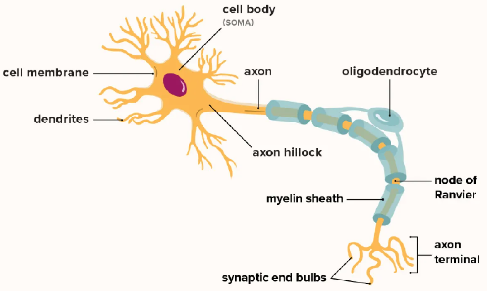
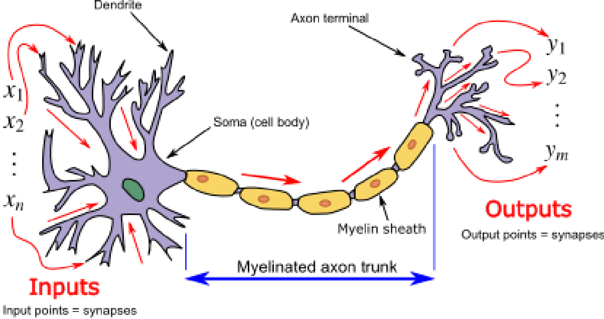
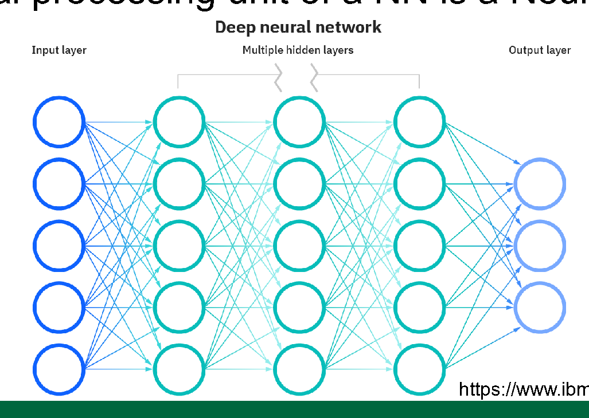
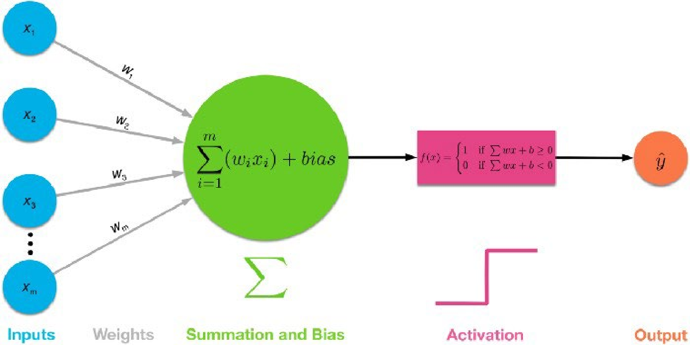
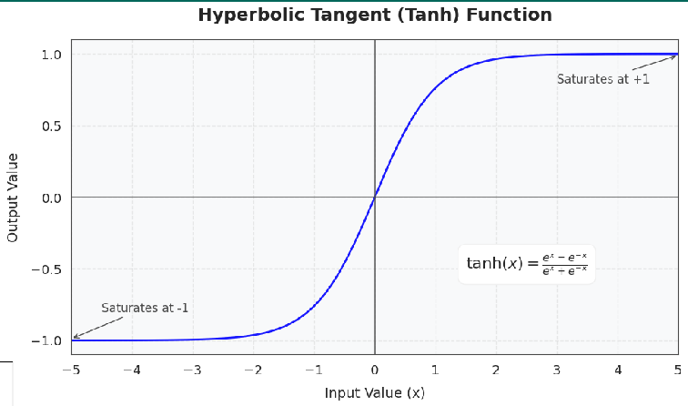
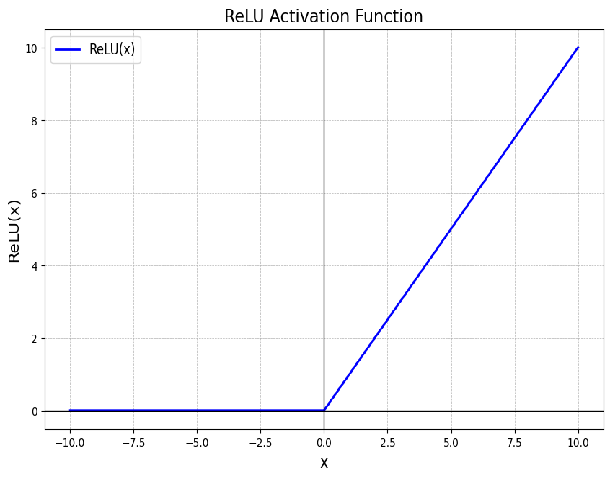

# 10 CST8502 NeuralNetworks4

_从 PDF 文档转换生成_

---

## 目录

- 第 1 页：**CST8502 Machine Learning**
- 第 2 页：**Agenda**
- 第 3 页：**Why We Need Neural Networks?**
- 第 4 页：**What Is a Neuron?**
- 第 5 页：**Structure of a Neuron**
- 第 6 页：**Biological Neuron Model**
- 第 7 页：**Artificial Neuron**
- 第 8 页：**What Is a Neural Network?**
- 第 9 页：**Neural Network Resources**
- 第 10 页：**Single-layer Perceptron Network**
- 第 11 页：**Activation Function**
- 第 12 页：**Common Activation Functions**
- 第 13 页：**Activation Functions — Graphs**
- 第 14 页：**Math Behind Artificial Neurons (I)**
- 第 15 页：**Math Behind Artificial Neurons (II)**
- 第 16 页：**Types of Neural Networks**
- 第 17 页：**Multi-layer Perceptron**
- 第 18 页：**How to Implement?**
- 第 19 页：**References**

---

_注: 共提取了 10 张图片_

## 第 1 页

**CST8502**
**MACHINE LEARNING**

**Neural Networks** Professor : Dr. Anu Thomas
Email: thomasa@algonquincollege.com
Office: T315

---

## 第 2 页

**Agenda**

- What is a neuron?
- What is a neural network?
- Types of Neural Networks
- Perceptron
- Multi-layer perceptron or feedforward
- Back Propagation
- CNN, RNN

---

## 第 3 页

**Why we need Neural Networks?**

---

## 第 4 页

**What is a Neuron?**

- Fundamental units of the brain and nervous system
- the cells responsible for receiving sensory input from the external world, for sending motor commands to our muscles, and for transforming and relaying the electrical signals at every step in between
- roughly 100 billion neurons do interact closely with other cell types

Taken from: [https://qbi.uq.edu.au/brain/brain-anatomy/what-neuron](https://qbi.uq.edu.au/brain/brain-anatomy/what-neuron)

---

## 第 5 页

**Structure of a Neuron**
Taken from: [https://www.healthline.com/health/neurons](https://www.healthline.com/health/neurons)

---

## 第 6 页

**Biological Neuron Model**
Neuron and myelinated axon, with signal flow from inputs at dendrites to outputs at axon terminals. The signal is a short electrical pulse called action potential or 'spike'.

---

## 第 7 页

**Artificial Neuron**

- Inputs: `x₁, x₂, …, xₙ`
- Weights: `w₁, w₂, …, wₙ`
- Weighted sum: `z = Σ (wᵢ * xᵢ) + b`
- Activation: `y = f(z)`
- As these neurons are artificial, neural networks are often called Artificial Neural Networks (ANNs).

---

## 第 8 页

**What is a Neural Network?**

- Biologically motivated approach to ML
- Fundamental processing unit of a NN is a Neuron

[https://www.ibm.com/cloud/learn/neural-networks](https://www.ibm.com/cloud/learn/neural-networks)

---

## 第 9 页

**Neural Network**

- [https://www.youtube.com/watch?v=ER2It2mIagI&list=PLeo1K3hjS3uu7CxAacxVndI4bE_o3BDtO&index=6&ab_channel=codebasics](https://www.youtube.com/watch?v=ER2It2mIagI&list=PLeo1K3hjS3uu7CxAacxVndI4bE_o3BDtO&index=6&ab_channel=codebasics)
- [https://www.youtube.com/watch?v=bfmFfD2RIcg&t=223s](https://www.youtube.com/watch?v=bfmFfD2RIcg&t=223s)

---

## 第 10 页

**Single-layer Perceptron Network**
Taken from: [https://towardsdatascience.com/multi-layer-neural-networks-with-sigmoid-function-deep-learning-for-rookies-2-bf464f09eb7f](https://towardsdatascience.com/multi-layer-neural-networks-with-sigmoid-function-deep-learning-for-rookies-2-bf464f09eb7f)

---

## 第 11 页

**Activation Function**
Sometimes, an activation function is as simple as:

`f(x) = 1 if w * x + b >= 0`
`f(x) = 0 if w * x + b < 0`

---

## 第 12 页

**Common Activation Functions**

- **Sigmoid**
  - Formula: `f(x) = 1 / (1 + e^(-x))`
  - Maps values between 0 and 1; often used in binary classification.
- **Tanh**
  - Formula: `f(x) = (e^x - e^(-x)) / (e^x + e^(-x))`
  - Maps values between -1 and 1; often used in hidden layers.
- **ReLU (Rectified Linear Unit)**
  - Formula: `f(x) = max(0, x)`
  - Returns x when x > 0; otherwise returns 0.
- **Softmax**
  - Formula: `f(x_i) = e^{x_i} / Σ e^{x_j}`
  - Used in multi-class classification; outputs probabilities that sum to 1.

---

## 第 13 页

**Activation Functions - Graphs**

---

## 第 14 页

**Math behind Artificial Neurons**

- Inputs x1, x2, …, xn
- Weights w1, w2, …, wn
- Net input function – input matrix \* weight matrix
- Threshold function – normalizes the result given by the net input function within a numeric range
- Error – how much is off from the actual result; used to readjust the weights accordingly

---

## 第 15 页

**Math behind Artificial Neurons**

- Learns by adjusting the weights until it can correctly classify the training data
- Takes a lot of time for training
- Has high tolerance to noisy data

---

## 第 16 页

**Types of Neural Networks**

- **Perceptron**
  - single neuron
  - Single layer perceptron can only learn linearly separable problems
- **Multi-layer Perceptron**
  - Input layer, one or more hidden layers, output layer
- **Feed-forward NN**
  - Data flows only in one direction, without any feedback loops or recurrent connections.
  - Uses back propagation for training
  - Repeatedly adjust the weights to minimize the difference between actual output and the desired output
- **Convolutional NN**
  - For image processing (2D/3D spatial data)
- **Recurrent NN**
  - For text/speech processing (sequential data)

---

## 第 17 页

**Multi-layer Perceptron**

- trains on two arrays:
  - array X which holds the training samples represented as floating point feature vectors;
  - array y which holds the target values (class labels) for those training samples
- Can set hidden layer sizes. Example: `hidden_layer_sizes = (5, 3)`
  - Number of elements corresponds to the number of layers
  - Each number corresponds to the number of neurons in that layer
  - In this example, there are 2 layers, first layer has 5 neurons, and the second one has 3 neurons

[https://scikit-learn.org/stable/modules/neural_networks_supervised.html](https://scikit-learn.org/stable/modules/neural_networks_supervised.html)

---

## 第 18 页

**How to implement?**

- Load dataset
- Split into train and test
- Preprocessing, if applicable
- Initialize classifier (model)
  - `mlp = MLPClassifier(hidden_layer_sizes=(50,), activation='relu', solver='adam', max_iter=500, random_state=42)`
- Solver
  - used to optimize the network's weights and biases by minimizing the loss function
  - responsible for updating the parameters of the model during training to improve performance.
- Fit the model using train set (training)
  - `mlp.fit(X_train, y_train)`
- Predict for test/new instances (testing)
  - `y_pred = mlp.predict(X_test)`

---

## 第 19 页

**References**

- [https://www.ibm.com/cloud/learn/neural-networks](https://www.ibm.com/cloud/learn/neural-networks)
- [https://www.youtube.com/watch?v=ER2It2mIagI&list=PLeo1K3hjS3uu7CxAacxVndI4bE_o3BDtO&index=6&ab_channel=codebasics](https://www.youtube.com/watch?v=ER2It2mIagI&list=PLeo1K3hjS3uu7CxAacxVndI4bE_o3BDtO&index=6&ab_channel=codebasics)
- [https://www.youtube.com/watch?v=bfmFfD2RIcg&t=223s](https://www.youtube.com/watch?v=bfmFfD2RIcg&t=223s)
- [https://python-course.eu/machine-learning/neural-network-digits-dataset.php](https://python-course.eu/machine-learning/neural-network-digits-dataset.php)

---
